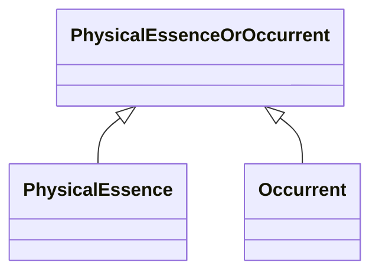

---
search:
  boost: 10.0
---

# Class: PhysicalEssenceOrOccurrent 


_Either a physical or processual entity._


<div data-search-exclude markdown="1">


URI: [namo:PhysicalEssenceOrOccurrent](https://w3id.org/monarch-initiative/namo/PhysicalEssenceOrOccurrent)





## Inheritance
* **PhysicalEssenceOrOccurrent**
    * [PhysicalEssence](PhysicalEssence.md)
    * [Occurrent](Occurrent.md)


## Class Properties

| Property | Value |
| --- | --- |
| Mixin | Yes |


## Slots

| Name | Cardinality and Range | Description | Inheritance |
| ---  | --- | --- | --- |


## Mixin Usage

| mixed into | description |
| --- | --- |


## Identifier and Mapping Information


### Schema Source


* from schema: https://w3id.org/monarch-initiative/namo


## Mappings

| Mapping Type | Mapped Value |
| ---  | ---  |
| self | namo:PhysicalEssenceOrOccurrent |
| native | namo:PhysicalEssenceOrOccurrent |


## LinkML Source

<!-- TODO: investigate https://stackoverflow.com/questions/37606292/how-to-create-tabbed-code-blocks-in-mkdocs-or-sphinx -->

### Direct

<details>
```yaml
name: physical essence or occurrent
description: Either a physical or processual entity.
from_schema: https://w3id.org/monarch-initiative/namo
mixin: true

```
</details>

### Induced

<details>
```yaml
name: physical essence or occurrent
description: Either a physical or processual entity.
from_schema: https://w3id.org/monarch-initiative/namo
mixin: true

```
</details></div>