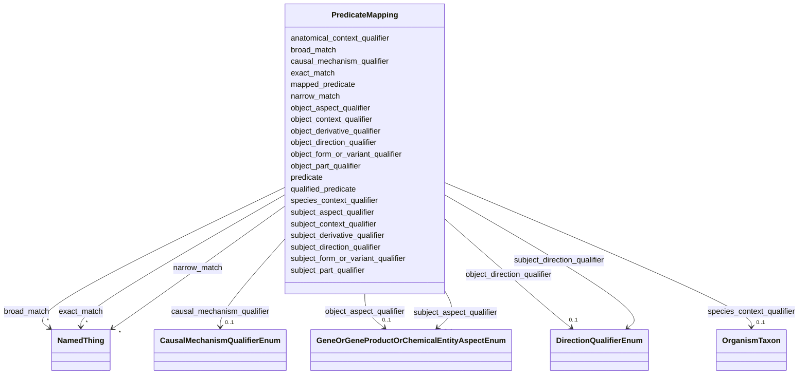

---
search:
  boost: 10.0
---

# Class: PredicateMapping 


_A deprecated predicate mapping object contains the deprecated predicate and an example of the rewiring that should be done to use a qualified statement in its place._


<div data-search-exclude markdown="1">


URI: [namo:PredicateMapping](https://w3id.org/monarch-initiative/namo/PredicateMapping)





<!-- no inheritance hierarchy -->

## Slots

| Name | Cardinality and Range | Description | Inheritance |
| ---  | --- | --- | --- |
| [mapped_predicate](mapped_predicate.md) | 0..1 <br/> [String](String.md) | The predicate that is being replaced by the fully qualified representation of... | direct |
| [subject_aspect_qualifier](subject_aspect_qualifier.md) | 0..1 <br/> [GeneOrGeneProductOrChemicalEntityAspectEnum](GeneOrGeneProductOrChemicalEntityAspectEnum.md) | Composes with the core concept to describe new concepts of a different ontolo... | direct |
| [subject_direction_qualifier](subject_direction_qualifier.md) | 0..1 <br/> [DirectionQualifierEnum](DirectionQualifierEnum.md) | Composes with the core concept (+ aspect if provided) to describe a change in... | direct |
| [subject_form_or_variant_qualifier](subject_form_or_variant_qualifier.md) | 0..1 <br/> [String](String.md) | A qualifier that composes with a core subject/object concept to define a spec... | direct |
| [subject_part_qualifier](subject_part_qualifier.md) | 0..1 <br/> [String](String.md) | defines a specific part/component of the core concept (used in cases there th... | direct |
| [subject_derivative_qualifier](subject_derivative_qualifier.md) | 0..1 <br/> [String](String.md) | A qualifier that composes with a core subject/object  concept to describe som... | direct |
| [subject_context_qualifier](subject_context_qualifier.md) | 0..1 <br/> [String](String.md) | A qualifier describing the context in which the subject of an association hol... | direct |
| [predicate](predicate.md) | 1 <br/> [Uriorcurie](Uriorcurie.md) | Has a value from the Biolink 'related_to' hierarchy | direct |
| [qualified_predicate](qualified_predicate.md) | 0..1 <br/> [Uriorcurie](Uriorcurie.md) | Predicate to be used in an association when subject and object qualifiers are... | direct |
| [object_aspect_qualifier](object_aspect_qualifier.md) | 0..1 <br/> [GeneOrGeneProductOrChemicalEntityAspectEnum](GeneOrGeneProductOrChemicalEntityAspectEnum.md) | Composes with the core concept to describe new concepts of a different ontolo... | direct |
| [object_direction_qualifier](object_direction_qualifier.md) | 0..1 <br/> [DirectionQualifierEnum](DirectionQualifierEnum.md) | Composes with the core concept (+ aspect if provided) to describe a change in... | direct |
| [object_form_or_variant_qualifier](object_form_or_variant_qualifier.md) | 0..1 <br/> [String](String.md) | A qualifier that composes with a core subject/object concept to define a spec... | direct |
| [object_part_qualifier](object_part_qualifier.md) | 0..1 <br/> [String](String.md) | defines a specific part/component of the core concept (used in cases there th... | direct |
| [object_derivative_qualifier](object_derivative_qualifier.md) | 0..1 <br/> [String](String.md) | A qualifier that composes with a core subject/object  concept to describe som... | direct |
| [object_context_qualifier](object_context_qualifier.md) | 0..1 <br/> [String](String.md) | A qualifier describing the context in which the object of an association hold... | direct |
| [causal_mechanism_qualifier](causal_mechanism_qualifier.md) | 0..1 <br/> [CausalMechanismQualifierEnum](CausalMechanismQualifierEnum.md) | A statement qualifier representing a type of molecular control mechanism thro... | direct |
| [anatomical_context_qualifier](anatomical_context_qualifier.md) | * <br/> [String](String.md) | A statement qualifier representing an anatomical location where an relationsh... | direct |
| [species_context_qualifier](species_context_qualifier.md) | 0..1 <br/> [OrganismTaxon](OrganismTaxon.md) | A statement qualifier representing a taxonomic category of species in which a... | direct |
| [exact_match](exact_match.md) | * <br/> [NamedThing](NamedThing.md) | holds between two entities that have strictly equivalent meanings, with a hig... | direct |
| [narrow_match](narrow_match.md) | * <br/> [NamedThing](NamedThing.md) | a list of terms from different schemas or terminology systems that have a nar... | direct |
| [broad_match](broad_match.md) | * <br/> [NamedThing](NamedThing.md) | a list of terms from different schemas or terminology systems that have a bro... | direct |


## Usages

| used by | used in | type | used |
| ---  | --- | --- | --- |
| [MappingCollection](MappingCollection.md) | [predicate_mappings](predicate_mappings.md) | range | [PredicateMapping](PredicateMapping.md) |


## Identifier and Mapping Information


### Schema Source


* from schema: https://w3id.org/monarch-initiative/namo


## Mappings

| Mapping Type | Mapped Value |
| ---  | ---  |
| self | namo:PredicateMapping |
| native | namo:PredicateMapping |


## LinkML Source

<!-- TODO: investigate https://stackoverflow.com/questions/37606292/how-to-create-tabbed-code-blocks-in-mkdocs-or-sphinx -->

### Direct

<details>
```yaml
name: predicate mapping
description: A deprecated predicate mapping object contains the deprecated predicate
  and an example of the rewiring that should be done to use a qualified statement
  in its place.
from_schema: https://w3id.org/monarch-initiative/namo
slots:
- mapped predicate
- subject aspect qualifier
- subject direction qualifier
- subject form or variant qualifier
- subject part qualifier
- subject derivative qualifier
- subject context qualifier
- predicate
- qualified predicate
- object aspect qualifier
- object direction qualifier
- object form or variant qualifier
- object part qualifier
- object derivative qualifier
- object context qualifier
- causal mechanism qualifier
- anatomical context qualifier
- species context qualifier
- exact match
- narrow match
- broad match

```
</details>

### Induced

<details>
```yaml
name: predicate mapping
description: A deprecated predicate mapping object contains the deprecated predicate
  and an example of the rewiring that should be done to use a qualified statement
  in its place.
from_schema: https://w3id.org/monarch-initiative/namo
attributes:
  mapped predicate:
    name: mapped predicate
    description: The predicate that is being replaced by the fully qualified representation
      of predicate + subject and object qualifiers.  Only to be used in test data
      and mapping data to help with the transition to the fully qualified predicate
      model. Not to be used in knowledge graphs.
    from_schema: https://w3id.org/monarch-initiative/namo
    rank: 1000
    alias: mapped_predicate
    owner: predicate mapping
    domain_of:
    - predicate mapping
    range: string
  subject aspect qualifier:
    name: subject aspect qualifier
    description: 'Composes with the core concept to describe new concepts of a different
      ontological type. e.g. a process in which the core concept participates, a function/activity/role
      held by the core concept, or a characteristic/quality that inheres in the core
      concept.  The purpose of the aspect slot is to indicate what aspect is being
      affected in an ''affects'' association.  This qualifier specifies a change in
      the subject of an association (aka: statement).'
    examples:
    - value: stability
    - value: abundance
    - value: expression
    - value: exposure
    in_subset:
    - translator_minimal
    from_schema: https://w3id.org/monarch-initiative/namo
    rank: 1000
    is_a: aspect qualifier
    domain: association
    alias: subject_aspect_qualifier
    owner: predicate mapping
    domain_of:
    - predicate mapping
    - gene to gene association
    - named thing associated with likelihood of named thing association
    - macromolecular machine has substrate association
    - chemical affects biological entity association
    - chemical gene sensitivity association
    - gene affects chemical association
    - entity to feature or disease qualifiers mixin
    - entity to feature or variant qualifiers mixin
    - entity to feature or gene qualifiers mixin
    - feature or disease qualifiers to entity mixin
    - gene to phenotypic feature association
    - gene to disease association
    - causal gene to disease association
    - correlated gene to disease association
    range: GeneOrGeneProductOrChemicalEntityAspectEnum
  subject direction qualifier:
    name: subject direction qualifier
    description: 'Composes with the core concept (+ aspect if provided) to describe
      a change in its direction or degree. This qualifier qualifies the subject of
      an association (aka: statement).'
    examples:
    - value: increased
    - value: downregulated
    in_subset:
    - translator_minimal
    from_schema: https://w3id.org/monarch-initiative/namo
    rank: 1000
    is_a: direction qualifier
    domain: association
    alias: subject_direction_qualifier
    owner: predicate mapping
    domain_of:
    - predicate mapping
    - gene to gene association
    - macromolecular machine has substrate association
    - chemical affects biological entity association
    - chemical gene sensitivity association
    - gene affects chemical association
    - entity to feature or disease qualifiers mixin
    - entity to feature or variant qualifiers mixin
    - entity to feature or gene qualifiers mixin
    - feature or disease qualifiers to entity mixin
    range: DirectionQualifierEnum
  subject form or variant qualifier:
    name: subject form or variant qualifier
    description: 'A qualifier that composes with a core subject/object concept to
      define a specific type, variant, alternative version of this concept. The composed
      concept remains a subtype or instance of the core concept. For example, the
      qualifier ‘mutation’ combines with the core concept ‘Gene X’ to express the
      compose concept ‘a mutation of Gene X’.  This qualifier specifies a change in
      the subject of an association (aka: statement).'
    examples:
    - value: mutation
    - value: late stage
    - value: severe
    - value: transplant
    - value: chemical analog
    in_subset:
    - translator_minimal
    from_schema: https://w3id.org/monarch-initiative/namo
    rank: 1000
    is_a: form or variant qualifier
    domain: association
    alias: subject_form_or_variant_qualifier
    owner: predicate mapping
    domain_of:
    - predicate mapping
    - chemical gene interaction association
    - macromolecular machine has substrate association
    - chemical affects biological entity association
    - chemical gene sensitivity association
    - gene affects chemical association
    - gene to phenotypic feature association
    - gene to disease association
    - causal gene to disease association
    - correlated gene to disease association
    - gene has variant that contributes to disease association
    range: string
  subject part qualifier:
    name: subject part qualifier
    description: defines a specific part/component of the core concept (used in cases
      there this specific part has no IRI we can use to directly represent it).  This
      qualifier is for the subject of an association (or statement).
    examples:
    - value: polyA tail
    - value: upstream control region
    in_subset:
    - translator_minimal
    from_schema: https://w3id.org/monarch-initiative/namo
    rank: 1000
    is_a: part qualifier
    domain: association
    alias: subject_part_qualifier
    owner: predicate mapping
    domain_of:
    - predicate mapping
    - chemical gene interaction association
    - macromolecular machine has substrate association
    - chemical affects biological entity association
    - chemical gene sensitivity association
    - gene affects chemical association
    range: string
  subject derivative qualifier:
    name: subject derivative qualifier
    description: A qualifier that composes with a core subject/object  concept to
      describe something that is derived from the core concept.  For example, the
      qualifier ‘metabolite’ combines with a ‘Chemical X’ core concept to express
      the composed concept ‘a metabolite of Chemical X’.  This qualifier is for the
      subject of an association (or statement).
    examples:
    - value: metabolite
    in_subset:
    - translator_minimal
    from_schema: https://w3id.org/monarch-initiative/namo
    rank: 1000
    is_a: derivative qualifier
    domain: association
    alias: subject_derivative_qualifier
    owner: predicate mapping
    domain_of:
    - predicate mapping
    - chemical gene interaction association
    - macromolecular machine has substrate association
    - chemical affects biological entity association
    - chemical gene sensitivity association
    - gene affects chemical association
    range: string
  subject context qualifier:
    name: subject context qualifier
    description: A qualifier describing the context in which the subject of an association
      holds.
    in_subset:
    - translator_minimal
    from_schema: https://w3id.org/monarch-initiative/namo
    rank: 1000
    is_a: context qualifier
    domain: association
    alias: subject_context_qualifier
    owner: predicate mapping
    domain_of:
    - predicate mapping
    - gene to gene association
    - named thing associated with likelihood of named thing association
    - chemical gene interaction association
    - macromolecular machine has substrate association
    - chemical affects biological entity association
    - gene affects chemical association
    range: string
  predicate:
    name: predicate
    local_names:
      ga4gh:
        local_name_source: ga4gh
        local_name_value: annotation predicate
      translator:
        local_name_source: translator
        local_name_value: predicate
    description: Has a value from the Biolink 'related_to' hierarchy. In RDF,  this
      corresponds to rdf:predicate and in Neo4j this corresponds to the relationship
      type. The convention is for an edge label in snake_case form. For example, biolink:related_to,
      biolink:causes, biolink:treats
    from_schema: https://w3id.org/monarch-initiative/namo
    exact_mappings:
    - owl:annotatedProperty
    - OBAN:association_has_predicate
    rank: 1000
    is_a: association slot
    domain: association
    slot_uri: rdf:predicate
    owner: predicate mapping
    domain_of:
    - predicate mapping
    - association
    - gene to gene association
    - cell line to entity association mixin
    - chemical entity to entity association mixin
    - drug to entity association mixin
    - chemical to entity association mixin
    - case to entity association mixin
    - chemical entity to chemical entity association
    - named thing associated with likelihood of named thing association
    - material sample to entity association mixin
    - material sample derivation association
    - disease to entity association mixin
    - entity to exposure event association mixin
    - entity to outcome association mixin
    - frequency qualifier mixin
    - entity to phenotypic feature association mixin
    - disease or phenotypic feature to entity association mixin
    - entity to disease or phenotypic feature association mixin
    - genotype to entity association mixin
    - case to disease association
    - case to variant association
    - case to gene association
    - gene to entity association mixin
    - variant to entity association mixin
    - model to disease association mixin
    - macromolecular machine to entity association mixin
    - organism taxon to entity association
    range: uriorcurie
    required: true
  qualified predicate:
    name: qualified predicate
    description: Predicate to be used in an association when subject and object qualifiers
      are present and the full reading of the statement requires a qualification to
      the predicate in use in order to refine or increase the specificity of the full
      statement reading.  Has a value from the Biolink 'related_to' hierarchy, for
      example, biolink:related_to, biolink:causes, biolink:treats This qualifier holds
      a relationship to be used instead of that expressed by the primary predicate,
      in a ‘full statement’ reading of the association, where qualifier-based semantics
      are included. This is necessary only in cases where the primary predicate does
      not work in a full statement reading.
    notes:
    - 'to express the statement that “Chemical X causes increased expression of Gene
      Y”, the core triple is read using the fields subject:ChemX, predicate:affects,
      object:GeneY . . . and the full statement is read using the fields subject:ChemX,
      qualified_predicate:causes, object:GeneY, object_aspect: expression, object_direction:increased.
      The predicate ‘affects’ is needed for the core triple reading, but does not
      make sense in the full statement reading  (because “Chemical X affects increased
      expression of Gene Y'''' is not what we mean to say here: it causes increased
      expression of Gene Y)'
    examples:
    - value: biolink:causes
      description: used with `affects` predicate to express causal statements
    from_schema: https://w3id.org/monarch-initiative/namo
    rank: 1000
    is_a: qualifier
    domain: association
    alias: qualified_predicate
    owner: predicate mapping
    domain_of:
    - predicate mapping
    - gene to gene association
    - chemical entity to biological process association
    - chemical gene interaction association
    - macromolecular machine has substrate association
    - gene regulates gene association
    - chemical affects biological entity association
    - chemical gene sensitivity association
    - gene affects chemical association
    - entity to feature or disease qualifiers mixin
    - entity to feature or variant qualifiers mixin
    - entity to feature or gene qualifiers mixin
    - feature or disease qualifiers to entity mixin
    - gene to disease association
    - causal gene to disease association
    - correlated gene to disease association
    range: uriorcurie
  object aspect qualifier:
    name: object aspect qualifier
    description: 'Composes with the core concept to describe new concepts of a different
      ontological type. e.g. a process in which the core concept participates, a function/activity/role
      held by the core concept, or a characteristic/quality that inheres in the core
      concept.  The purpose of the aspect slot is to indicate what aspect is being
      affected in an ''affects'' association.  This qualifier specifies a change in
      the object of an association (aka: statement).'
    examples:
    - value: stability
    - value: abundance
    - value: expression
    - value: exposure
    in_subset:
    - translator_minimal
    from_schema: https://w3id.org/monarch-initiative/namo
    rank: 1000
    is_a: aspect qualifier
    domain: association
    alias: object_aspect_qualifier
    owner: predicate mapping
    domain_of:
    - predicate mapping
    - gene to gene association
    - named thing associated with likelihood of named thing association
    - chemical gene interaction association
    - macromolecular machine has substrate association
    - gene regulates gene association
    - chemical affects biological entity association
    - chemical gene sensitivity association
    - gene affects chemical association
    - entity to feature or disease qualifiers mixin
    - entity to feature or variant qualifiers mixin
    - entity to feature or gene qualifiers mixin
    - feature or disease qualifiers to entity mixin
    range: GeneOrGeneProductOrChemicalEntityAspectEnum
  object direction qualifier:
    name: object direction qualifier
    description: 'Composes with the core concept (+ aspect if provided) to describe
      a change in its direction or degree. This qualifier qualifies the object of
      an association (aka: statement).'
    examples:
    - value: increased
    - value: downregulated
    in_subset:
    - translator_minimal
    from_schema: https://w3id.org/monarch-initiative/namo
    rank: 1000
    is_a: direction qualifier
    domain: association
    alias: object_direction_qualifier
    owner: predicate mapping
    domain_of:
    - predicate mapping
    - gene to gene association
    - chemical entity to biological process association
    - chemical gene interaction association
    - macromolecular machine has substrate association
    - gene regulates gene association
    - chemical affects biological entity association
    - chemical gene sensitivity association
    - gene affects chemical association
    - entity to feature or disease qualifiers mixin
    - entity to feature or variant qualifiers mixin
    - entity to feature or gene qualifiers mixin
    - feature or disease qualifiers to entity mixin
    - gene to phenotypic feature association
    - gene to disease association
    - causal gene to disease association
    - correlated gene to disease association
    - chemical entity or gene or gene product regulates gene association
    range: DirectionQualifierEnum
  object form or variant qualifier:
    name: object form or variant qualifier
    description: 'A qualifier that composes with a core subject/object concept to
      define a specific type, variant, alternative version of this concept. The composed
      concept remains a subtype or instance of the core concept. For example, the
      qualifier ‘mutation’ combines with the core concept ‘Gene X’ to express the
      compose concept ‘a mutation of Gene X’.  This qualifier specifies a change in
      the object of an association (aka: statement).'
    examples:
    - value: mutation
    - value: late stage
    - value: severe
    - value: transplant
    - value: chemical analog
    in_subset:
    - translator_minimal
    from_schema: https://w3id.org/monarch-initiative/namo
    rank: 1000
    is_a: form or variant qualifier
    domain: association
    alias: object_form_or_variant_qualifier
    owner: predicate mapping
    domain_of:
    - predicate mapping
    - chemical gene interaction association
    - macromolecular machine has substrate association
    - chemical affects biological entity association
    - chemical gene sensitivity association
    - gene affects chemical association
    range: string
  object part qualifier:
    name: object part qualifier
    description: defines a specific part/component of the core concept (used in cases
      there this specific part has no IRI we can use to directly represent it).  This
      qualifier is for the object of an association (or statement).
    examples:
    - value: polyA tail
    - value: upstream control region
    in_subset:
    - translator_minimal
    from_schema: https://w3id.org/monarch-initiative/namo
    rank: 1000
    is_a: part qualifier
    domain: association
    alias: object_part_qualifier
    owner: predicate mapping
    domain_of:
    - predicate mapping
    - chemical gene interaction association
    - macromolecular machine has substrate association
    - chemical affects biological entity association
    - chemical gene sensitivity association
    - gene affects chemical association
    range: string
  object derivative qualifier:
    name: object derivative qualifier
    description: A qualifier that composes with a core subject/object  concept to
      describe something that is derived from the core concept.  For example, the
      qualifier ‘metabolite’ combines with a ‘Chemical X’ core concept to express
      the composed concept ‘a metabolite of Chemical X’.  This qualifier is for the
      object of an association (or statement).
    examples:
    - value: metabolite
    in_subset:
    - translator_minimal
    from_schema: https://w3id.org/monarch-initiative/namo
    rank: 1000
    is_a: derivative qualifier
    domain: association
    alias: object_derivative_qualifier
    owner: predicate mapping
    domain_of:
    - predicate mapping
    - chemical gene sensitivity association
    - gene affects chemical association
    range: string
  object context qualifier:
    name: object context qualifier
    description: A qualifier describing the context in which the object of an association
      holds.
    in_subset:
    - translator_minimal
    from_schema: https://w3id.org/monarch-initiative/namo
    rank: 1000
    is_a: context qualifier
    domain: association
    alias: object_context_qualifier
    owner: predicate mapping
    domain_of:
    - predicate mapping
    - gene to gene association
    - named thing associated with likelihood of named thing association
    - chemical gene interaction association
    - macromolecular machine has substrate association
    - chemical affects biological entity association
    - gene affects chemical association
    range: string
  causal mechanism qualifier:
    name: causal mechanism qualifier
    description: A statement qualifier representing a type of molecular control mechanism
      through which an effect of a chemical on a gene or gene product is mediated
    examples:
    - value: agonism
    - value: inhibition
    in_subset:
    - translator_minimal
    from_schema: https://w3id.org/monarch-initiative/namo
    rank: 1000
    is_a: statement qualifier
    domain: association
    alias: causal_mechanism_qualifier
    owner: predicate mapping
    domain_of:
    - predicate mapping
    - gene to gene association
    - chemical gene interaction association
    - macromolecular machine has substrate association
    - gene regulates gene association
    - chemical affects biological entity association
    - gene affects chemical association
    range: CausalMechanismQualifierEnum
  anatomical context qualifier:
    name: anatomical context qualifier
    description: A statement qualifier representing an anatomical location where an
      relationship expressed in an association took place (can be a tissue, cell type,
      or sub-cellular location).
    notes:
    - Anatomical context values can be any term from UBERON. For example, the context
      qualifier ‘cerebral cortext’ combines with a core concept of ‘neuron’ to express
      the composed concept ‘neuron in the cerebral cortext’. The species_context_qualifier
      applies taxonomic context.  Ontology CURIEs are expected as values here, the
      examples below are intended to help clarify the content of the CURIEs.
    examples:
    - value: UBERON:0000178
      description: blood
    - value: UBERON:0000956
      description: cerebral cortex
    - value: GO:0005794
      description: Golgi apparatus
    in_subset:
    - translator_minimal
    from_schema: https://w3id.org/monarch-initiative/namo
    rank: 1000
    is_a: statement qualifier
    domain: association
    alias: anatomical_context_qualifier
    owner: predicate mapping
    domain_of:
    - predicate mapping
    - chemical entity to biological process association
    - chemical gene interaction association
    - macromolecular machine has substrate association
    - chemical affects biological entity association
    - chemical gene sensitivity association
    - gene affects chemical association
    - entity to disease or phenotypic feature association mixin
    range: string
    multivalued: true
  species context qualifier:
    name: species context qualifier
    description: A statement qualifier representing a taxonomic category of species
      in which a relationship expressed in an association took place.
    notes:
    - Ontology CURIEs are expected as values here, the examples below are intended
      to help clarify the content of the CURIEs.
    examples:
    - value: NCBITaxon:7955
      description: zebrafish
    - value: NCBITaxon:9606
      description: human
    in_subset:
    - translator_minimal
    from_schema: https://w3id.org/monarch-initiative/namo
    rank: 1000
    is_a: statement qualifier
    domain: association
    alias: species_context_qualifier
    owner: predicate mapping
    domain_of:
    - predicate mapping
    - gene to gene association
    - chemical entity to chemical entity association
    - chemical entity to biological process association
    - chemical gene interaction association
    - macromolecular machine has substrate association
    - gene regulates gene association
    - chemical affects biological entity association
    - chemical gene sensitivity association
    - gene affects chemical association
    - macromolecular machine to entity association mixin
    range: organism taxon
  exact match:
    name: exact match
    annotations:
      canonical_predicate:
        tag: canonical_predicate
        value: true
    description: holds between two entities that have strictly equivalent meanings,
      with a high degree of confidence
    in_subset:
    - translator_minimal
    from_schema: https://w3id.org/monarch-initiative/namo
    exact_mappings:
    - skos:exactMatch
    - WIKIDATA:Q39893449
    - WIKIDATA:P2888
    rank: 1000
    is_a: close match
    domain: named thing
    inherited: true
    alias: exact_match
    owner: predicate mapping
    domain_of:
    - predicate mapping
    symmetric: true
    range: named thing
    multivalued: true
  narrow match:
    name: narrow match
    annotations:
      opposite_of:
        tag: opposite_of
        value: broad match
    description: a list of terms from different schemas or terminology systems that
      have a narrower, more specific meaning. Narrower terms are typically shown as
      children in a hierarchy or tree.
    in_subset:
    - translator_minimal
    from_schema: https://w3id.org/monarch-initiative/namo
    exact_mappings:
    - skos:narrowMatch
    - WIKIDATA:Q39893967
    rank: 1000
    is_a: related to at concept level
    domain: named thing
    inherited: true
    alias: narrow_match
    owner: predicate mapping
    domain_of:
    - predicate mapping
    inverse: broad match
    range: named thing
    multivalued: true
  broad match:
    name: broad match
    annotations:
      canonical_predicate:
        tag: canonical_predicate
        value: true
      opposite_of:
        tag: opposite_of
        value: narrow match
    description: a list of terms from different schemas or terminology systems that
      have a broader, more general meaning. Broader terms are typically shown as parents
      in a hierarchy or tree.
    in_subset:
    - translator_minimal
    from_schema: https://w3id.org/monarch-initiative/namo
    exact_mappings:
    - skos:broadMatch
    - WIKIDATA:Q39894595
    rank: 1000
    is_a: related to at concept level
    domain: named thing
    inherited: true
    alias: broad_match
    owner: predicate mapping
    domain_of:
    - predicate mapping
    range: named thing
    multivalued: true

```
</details></div>