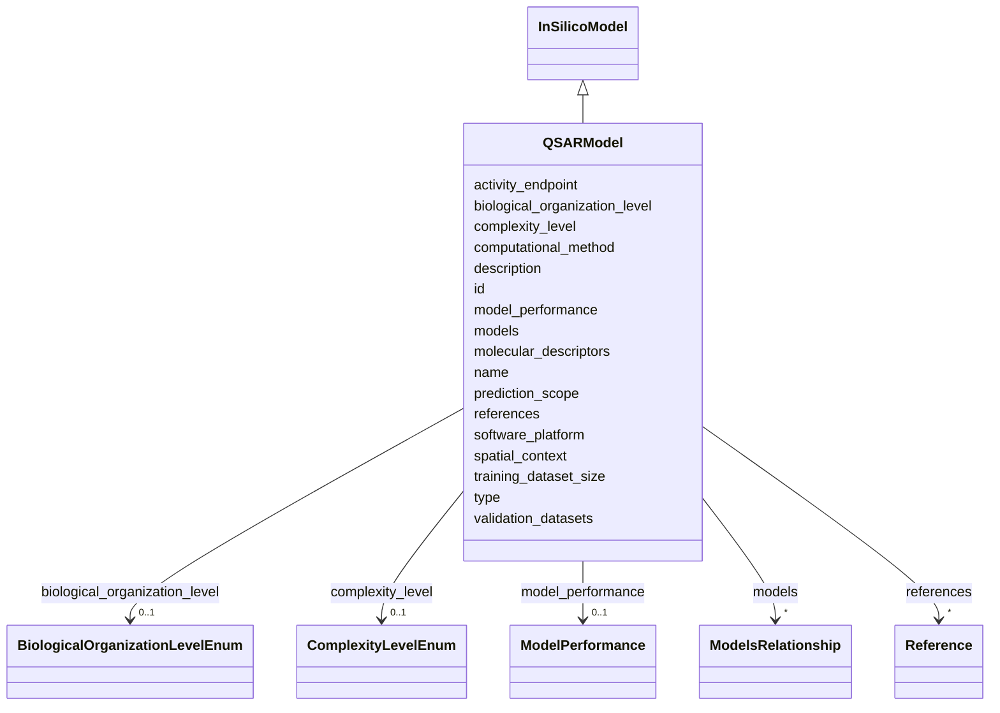

# Class: QSARModel 


_Quantitative Structure-Activity Relationship models that predict  chemical/biological activity from molecular structure._


URI: [namo:QSARModel](https://w3id.org/monarch-initiative/namo/QSARModel)





## Inheritance
* [NamedThing](NamedThing.md)
    * [ModelSystem](ModelSystem.md)
        * [NAMModel](NAMModel.md)
            * [InSilicoModel](InSilicoModel.md)
                * **QSARModel**


## Slots

| Name | Cardinality and Range | Description | Inheritance |
| ---  | --- | --- | --- |
| [molecular_descriptors](molecular_descriptors.md) | * <br/> [String](String.md) | Types of molecular descriptors used (topological, electronic, etc | direct |
| [activity_endpoint](activity_endpoint.md) | 0..1 <br/> [String](String.md) | Biological activity or property being predicted | direct |
| [training_dataset_size](training_dataset_size.md) | 0..1 <br/> [Integer](Integer.md) | Number of compounds in training dataset | direct |
| [model_performance](model_performance.md) | 0..1 <br/> [ModelPerformance](ModelPerformance.md) | Statistical performance metrics of the model | direct |
| [computational_method](computational_method.md) | 0..1 <br/> [String](String.md) | Primary computational method or algorithm used | [InSilicoModel](InSilicoModel.md) |
| [software_platform](software_platform.md) | 0..1 <br/> [String](String.md) | Software platform or programming language used | [InSilicoModel](InSilicoModel.md) |
| [validation_datasets](validation_datasets.md) | * <br/> [String](String.md) | Datasets used for model training and validation | [InSilicoModel](InSilicoModel.md) |
| [prediction_scope](prediction_scope.md) | 0..1 <br/> [String](String.md) | Scope and limitations of model predictions | [InSilicoModel](InSilicoModel.md) |
| [biological_organization_level](biological_organization_level.md) | 0..1 <br/> [BiologicalOrganizationLevelEnum](BiologicalOrganizationLevelEnum.md) | The level of biological organization represented by the model | [NAMModel](NAMModel.md) |
| [spatial_context](spatial_context.md) | 0..1 <br/> [String](String.md) | Description of spatial organization and context captured by the model | [NAMModel](NAMModel.md) |
| [complexity_level](complexity_level.md) | 0..1 <br/> [ComplexityLevelEnum](ComplexityLevelEnum.md) | Level of biological complexity represented (subcellular, cellular, tissue, or... | [NAMModel](NAMModel.md) |
| [references](references.md) | * <br/> [Reference](Reference.md) | Literature references that describe, validate, or support this model | [NAMModel](NAMModel.md) |
| [models](models.md) | * <br/> [ModelsRelationship](ModelsRelationship.md) |  | [ModelSystem](ModelSystem.md) |
| [id](id.md) | 1 <br/> [Uriorcurie](Uriorcurie.md) | A unique identifier for a thing | [NamedThing](NamedThing.md) |
| [name](name.md) | 0..1 <br/> [String](String.md) | A human-readable name for a thing | [NamedThing](NamedThing.md) |
| [description](description.md) | 0..1 <br/> [String](String.md) | A human-readable description for a thing | [NamedThing](NamedThing.md) |
| [type](type.md) | 0..1 <br/> [String](String.md) |  | [NamedThing](NamedThing.md) |


## Identifier and Mapping Information


### Schema Source


* from schema: https://w3id.org/monarch-initiative/namo


## Mappings

| Mapping Type | Mapped Value |
| ---  | ---  |
| self | namo:QSARModel |
| native | namo:QSARModel |


## LinkML Source

<!-- TODO: investigate https://stackoverflow.com/questions/37606292/how-to-create-tabbed-code-blocks-in-mkdocs-or-sphinx -->

### Direct

<details>
```yaml
name: QSARModel
description: Quantitative Structure-Activity Relationship models that predict  chemical/biological
  activity from molecular structure.
from_schema: https://w3id.org/monarch-initiative/namo
is_a: InSilicoModel
attributes:
  molecular_descriptors:
    name: molecular_descriptors
    description: Types of molecular descriptors used (topological, electronic, etc.)
    from_schema: https://w3id.org/monarch-initiative/namo
    rank: 1000
    domain_of:
    - QSARModel
    multivalued: true
  activity_endpoint:
    name: activity_endpoint
    description: Biological activity or property being predicted
    from_schema: https://w3id.org/monarch-initiative/namo
    rank: 1000
    domain_of:
    - QSARModel
  training_dataset_size:
    name: training_dataset_size
    description: Number of compounds in training dataset
    from_schema: https://w3id.org/monarch-initiative/namo
    rank: 1000
    domain_of:
    - QSARModel
    range: integer
  model_performance:
    name: model_performance
    description: Statistical performance metrics of the model
    from_schema: https://w3id.org/monarch-initiative/namo
    rank: 1000
    domain_of:
    - QSARModel
    range: ModelPerformance
    inlined: true

```
</details>

### Induced

<details>
```yaml
name: QSARModel
description: Quantitative Structure-Activity Relationship models that predict  chemical/biological
  activity from molecular structure.
from_schema: https://w3id.org/monarch-initiative/namo
is_a: InSilicoModel
attributes:
  molecular_descriptors:
    name: molecular_descriptors
    description: Types of molecular descriptors used (topological, electronic, etc.)
    from_schema: https://w3id.org/monarch-initiative/namo
    rank: 1000
    alias: molecular_descriptors
    owner: QSARModel
    domain_of:
    - QSARModel
    range: string
    multivalued: true
  activity_endpoint:
    name: activity_endpoint
    description: Biological activity or property being predicted
    from_schema: https://w3id.org/monarch-initiative/namo
    rank: 1000
    alias: activity_endpoint
    owner: QSARModel
    domain_of:
    - QSARModel
    range: string
  training_dataset_size:
    name: training_dataset_size
    description: Number of compounds in training dataset
    from_schema: https://w3id.org/monarch-initiative/namo
    rank: 1000
    alias: training_dataset_size
    owner: QSARModel
    domain_of:
    - QSARModel
    range: integer
  model_performance:
    name: model_performance
    description: Statistical performance metrics of the model
    from_schema: https://w3id.org/monarch-initiative/namo
    rank: 1000
    alias: model_performance
    owner: QSARModel
    domain_of:
    - QSARModel
    range: ModelPerformance
    inlined: true
  computational_method:
    name: computational_method
    description: Primary computational method or algorithm used
    from_schema: https://w3id.org/monarch-initiative/namo
    rank: 1000
    alias: computational_method
    owner: QSARModel
    domain_of:
    - InSilicoModel
    range: string
  software_platform:
    name: software_platform
    description: Software platform or programming language used
    from_schema: https://w3id.org/monarch-initiative/namo
    rank: 1000
    alias: software_platform
    owner: QSARModel
    domain_of:
    - InSilicoModel
    range: string
  validation_datasets:
    name: validation_datasets
    description: Datasets used for model training and validation
    from_schema: https://w3id.org/monarch-initiative/namo
    rank: 1000
    alias: validation_datasets
    owner: QSARModel
    domain_of:
    - InSilicoModel
    range: string
    multivalued: true
  prediction_scope:
    name: prediction_scope
    description: Scope and limitations of model predictions
    from_schema: https://w3id.org/monarch-initiative/namo
    rank: 1000
    alias: prediction_scope
    owner: QSARModel
    domain_of:
    - InSilicoModel
    range: string
  biological_organization_level:
    name: biological_organization_level
    description: The level of biological organization represented by the model
    from_schema: https://w3id.org/monarch-initiative/namo
    rank: 1000
    alias: biological_organization_level
    owner: QSARModel
    domain_of:
    - NAMModel
    range: BiologicalOrganizationLevelEnum
  spatial_context:
    name: spatial_context
    description: Description of spatial organization and context captured by the model
    from_schema: https://w3id.org/monarch-initiative/namo
    rank: 1000
    alias: spatial_context
    owner: QSARModel
    domain_of:
    - NAMModel
    range: string
  complexity_level:
    name: complexity_level
    description: Level of biological complexity represented (subcellular, cellular,
      tissue, organ, system)
    from_schema: https://w3id.org/monarch-initiative/namo
    rank: 1000
    alias: complexity_level
    owner: QSARModel
    domain_of:
    - NAMModel
    range: ComplexityLevelEnum
  references:
    name: references
    description: Literature references that describe, validate, or support this model
    from_schema: https://w3id.org/monarch-initiative/namo
    rank: 1000
    alias: references
    owner: QSARModel
    domain_of:
    - NAMModel
    range: Reference
    multivalued: true
    inlined: true
    inlined_as_list: true
  models:
    name: models
    from_schema: https://w3id.org/monarch-initiative/namo
    rank: 1000
    alias: models
    owner: QSARModel
    domain_of:
    - ModelSystem
    range: ModelsRelationship
    multivalued: true
  id:
    name: id
    description: A unique identifier for a thing
    from_schema: https://w3id.org/monarch-initiative/namo
    rank: 1000
    slot_uri: schema:identifier
    identifier: true
    alias: id
    owner: QSARModel
    domain_of:
    - NamedThing
    - Reference
    range: uriorcurie
    required: true
  name:
    name: name
    description: A human-readable name for a thing
    from_schema: https://w3id.org/monarch-initiative/namo
    rank: 1000
    slot_uri: schema:name
    alias: name
    owner: QSARModel
    domain_of:
    - NamedThing
    range: string
  description:
    name: description
    description: A human-readable description for a thing
    from_schema: https://w3id.org/monarch-initiative/namo
    rank: 1000
    slot_uri: schema:description
    alias: description
    owner: QSARModel
    domain_of:
    - NamedThing
    range: string
  type:
    name: type
    from_schema: https://w3id.org/monarch-initiative/namo
    rank: 1000
    designates_type: true
    alias: type
    owner: QSARModel
    domain_of:
    - NamedThing
    range: string

```
</details>