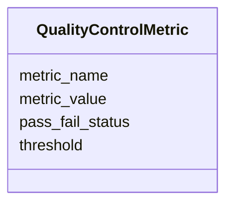

# Class: QualityControlMetric 


_A quality control measure and its associated value._


URI: [namo:QualityControlMetric](https://w3id.org/monarch-initiative/namo/QualityControlMetric)





<!-- no inheritance hierarchy -->


## Slots

| Name | Cardinality and Range | Description | Inheritance |
| ---  | --- | --- | --- |
| [metric_name](metric_name.md) | 0..1 <br/> [String](String.md) | Name of the quality control metric | direct |
| [metric_value](metric_value.md) | 0..1 <br/> [Float](Float.md) | Value of the quality control metric | direct |
| [threshold](threshold.md) | 0..1 <br/> [Float](Float.md) | Acceptable threshold for this metric | direct |
| [pass_fail_status](pass_fail_status.md) | 0..1 <br/> [Boolean](Boolean.md) | Whether this metric passes quality control criteria | direct |


## Usages

| used by | used in | type | used |
| ---  | --- | --- | --- |
| [Reproducibility](Reproducibility.md) | [quality_control_metrics](quality_control_metrics.md) | range | [QualityControlMetric](QualityControlMetric.md) |


## Identifier and Mapping Information


### Schema Source


* from schema: https://w3id.org/monarch-initiative/namo


## Mappings

| Mapping Type | Mapped Value |
| ---  | ---  |
| self | namo:QualityControlMetric |
| native | namo:QualityControlMetric |


## LinkML Source

<!-- TODO: investigate https://stackoverflow.com/questions/37606292/how-to-create-tabbed-code-blocks-in-mkdocs-or-sphinx -->

### Direct

<details>
```yaml
name: QualityControlMetric
description: A quality control measure and its associated value.
from_schema: https://w3id.org/monarch-initiative/namo
attributes:
  metric_name:
    name: metric_name
    description: Name of the quality control metric.
    from_schema: https://w3id.org/monarch-initiative/namo
    rank: 1000
    domain_of:
    - QualityControlMetric
  metric_value:
    name: metric_value
    description: Value of the quality control metric.
    from_schema: https://w3id.org/monarch-initiative/namo
    rank: 1000
    domain_of:
    - QualityControlMetric
    range: float
  threshold:
    name: threshold
    description: Acceptable threshold for this metric.
    from_schema: https://w3id.org/monarch-initiative/namo
    rank: 1000
    domain_of:
    - QualityControlMetric
    range: float
  pass_fail_status:
    name: pass_fail_status
    description: Whether this metric passes quality control criteria.
    from_schema: https://w3id.org/monarch-initiative/namo
    rank: 1000
    domain_of:
    - QualityControlMetric
    range: boolean

```
</details>

### Induced

<details>
```yaml
name: QualityControlMetric
description: A quality control measure and its associated value.
from_schema: https://w3id.org/monarch-initiative/namo
attributes:
  metric_name:
    name: metric_name
    description: Name of the quality control metric.
    from_schema: https://w3id.org/monarch-initiative/namo
    rank: 1000
    alias: metric_name
    owner: QualityControlMetric
    domain_of:
    - QualityControlMetric
    range: string
  metric_value:
    name: metric_value
    description: Value of the quality control metric.
    from_schema: https://w3id.org/monarch-initiative/namo
    rank: 1000
    alias: metric_value
    owner: QualityControlMetric
    domain_of:
    - QualityControlMetric
    range: float
  threshold:
    name: threshold
    description: Acceptable threshold for this metric.
    from_schema: https://w3id.org/monarch-initiative/namo
    rank: 1000
    alias: threshold
    owner: QualityControlMetric
    domain_of:
    - QualityControlMetric
    range: float
  pass_fail_status:
    name: pass_fail_status
    description: Whether this metric passes quality control criteria.
    from_schema: https://w3id.org/monarch-initiative/namo
    rank: 1000
    alias: pass_fail_status
    owner: QualityControlMetric
    domain_of:
    - QualityControlMetric
    range: boolean

```
</details>