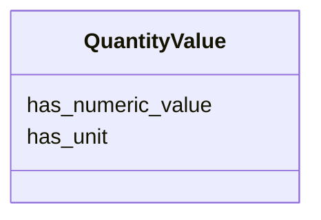

---
search:
  boost: 10.0
---

# Class: QuantityValue 


_A value of an attribute that is quantitative and measurable, expressed as a combination of a unit and a numeric value. Biolink models this as an annotation rather than a named thing, so it has no identifier and is inlined by value._


<div data-search-exclude markdown="1">


URI: [biolink:QuantityValue](https://w3id.org/biolink/QuantityValue)





<!-- no inheritance hierarchy -->

## Class Properties

| Property | Value |
| --- | --- |
| Class URI | [biolink:QuantityValue](https://w3id.org/biolink/QuantityValue) |


## Slots

| Name | Cardinality and Range | Description | Inheritance |
| ---  | --- | --- | --- |
| [has_numeric_value](has_numeric_value.md) | 0..1 <br/> [Double](Double.md) | The numeric portion of the quantity | direct |
| [has_unit](has_unit.md) | 0..1 <br/> [Uriorcurie](Uriorcurie.md) | The unit of measurement, as a UO CURIE | direct |


## Usages

| used by | used in | type | used |
| ---  | --- | --- | --- |
| [AnimalModel](AnimalModel.md) | [age_value](age_value.md) | range | [QuantityValue](QuantityValue.md) |


## Identifier and Mapping Information


### Schema Source


* from schema: https://w3id.org/monarch-initiative/namo


## Mappings

| Mapping Type | Mapped Value |
| ---  | ---  |
| self | biolink:QuantityValue |
| native | namo:QuantityValue |


## LinkML Source

<!-- TODO: investigate https://stackoverflow.com/questions/37606292/how-to-create-tabbed-code-blocks-in-mkdocs-or-sphinx -->

### Direct

<details>
```yaml
name: QuantityValue
description: A value of an attribute that is quantitative and measurable, expressed
  as a combination of a unit and a numeric value. Biolink models this as an annotation
  rather than a named thing, so it has no identifier and is inlined by value.
from_schema: https://w3id.org/monarch-initiative/namo
attributes:
  has_numeric_value:
    name: has_numeric_value
    description: The numeric portion of the quantity.
    from_schema: https://w3id.org/monarch-initiative/namo
    rank: 1000
    slot_uri: biolink:has_numeric_value
    domain_of:
    - QuantityValue
    range: double
  has_unit:
    name: has_unit
    description: The unit of measurement, as a UO CURIE.
    from_schema: https://w3id.org/monarch-initiative/namo
    rank: 1000
    slot_uri: biolink:has_unit
    domain_of:
    - QuantityValue
    range: uriorcurie
class_uri: biolink:QuantityValue

```
</details>

### Induced

<details>
```yaml
name: QuantityValue
description: A value of an attribute that is quantitative and measurable, expressed
  as a combination of a unit and a numeric value. Biolink models this as an annotation
  rather than a named thing, so it has no identifier and is inlined by value.
from_schema: https://w3id.org/monarch-initiative/namo
attributes:
  has_numeric_value:
    name: has_numeric_value
    description: The numeric portion of the quantity.
    from_schema: https://w3id.org/monarch-initiative/namo
    rank: 1000
    slot_uri: biolink:has_numeric_value
    owner: QuantityValue
    domain_of:
    - QuantityValue
    range: double
  has_unit:
    name: has_unit
    description: The unit of measurement, as a UO CURIE.
    from_schema: https://w3id.org/monarch-initiative/namo
    rank: 1000
    slot_uri: biolink:has_unit
    owner: QuantityValue
    domain_of:
    - QuantityValue
    range: uriorcurie
class_uri: biolink:QuantityValue

```
</details></div>