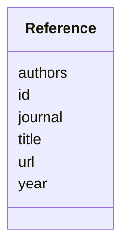

# Class: Reference 


_A literature reference with identifier and title for citing published work._


URI: [namo:Reference](https://w3id.org/monarch-initiative/namo/Reference)





<!-- no inheritance hierarchy -->


## Slots

| Name | Cardinality and Range | Description | Inheritance |
| ---  | --- | --- | --- |
| [id](id.md) | 1 <br/> [Uriorcurie](Uriorcurie.md) | Persistent identifier for the reference (DOI, PMID, PMCID, etc | direct |
| [title](title.md) | 1 <br/> [String](String.md) | Title of the referenced publication or dataset | direct |
| [authors](authors.md) | * <br/> [String](String.md) | Authors of the publication | direct |
| [journal](journal.md) | 0..1 <br/> [String](String.md) | Journal or publication venue | direct |
| [year](year.md) | 0..1 <br/> [Integer](Integer.md) | Publication year | direct |
| [url](url.md) | 0..1 <br/> [Uri](Uri.md) | URL to access the publication | direct |


## Usages

| used by | used in | type | used |
| ---  | --- | --- | --- |
| [NAMModel](NAMModel.md) | [references](references.md) | range | [Reference](Reference.md) |
| [CellularSystem](CellularSystem.md) | [references](references.md) | range | [Reference](Reference.md) |
| [TwoDCellCulture](TwoDCellCulture.md) | [references](references.md) | range | [Reference](Reference.md) |
| [ThreeDCellCulture](ThreeDCellCulture.md) | [references](references.md) | range | [Reference](Reference.md) |
| [CoCulture](CoCulture.md) | [references](references.md) | range | [Reference](Reference.md) |
| [Organoid](Organoid.md) | [references](references.md) | range | [Reference](Reference.md) |
| [CellLineModel](CellLineModel.md) | [references](references.md) | range | [Reference](Reference.md) |
| [MicrophysiologicalSystem](MicrophysiologicalSystem.md) | [references](references.md) | range | [Reference](Reference.md) |
| [OrganOnChip](OrganOnChip.md) | [references](references.md) | range | [Reference](Reference.md) |
| [TissueOnChip](TissueOnChip.md) | [references](references.md) | range | [Reference](Reference.md) |
| [InSilicoModel](InSilicoModel.md) | [references](references.md) | range | [Reference](Reference.md) |
| [QSARModel](QSARModel.md) | [references](references.md) | range | [Reference](Reference.md) |
| [PBPKModel](PBPKModel.md) | [references](references.md) | range | [Reference](Reference.md) |
| [DigitalTwin](DigitalTwin.md) | [references](references.md) | range | [Reference](Reference.md) |
| [MLModel](MLModel.md) | [references](references.md) | range | [Reference](Reference.md) |
| [MetabolicModel](MetabolicModel.md) | [references](references.md) | range | [Reference](Reference.md) |


## Identifier and Mapping Information


### Schema Source


* from schema: https://w3id.org/monarch-initiative/namo


## Mappings

| Mapping Type | Mapped Value |
| ---  | ---  |
| self | namo:Reference |
| native | namo:Reference |


## LinkML Source

<!-- TODO: investigate https://stackoverflow.com/questions/37606292/how-to-create-tabbed-code-blocks-in-mkdocs-or-sphinx -->

### Direct

<details>
```yaml
name: Reference
description: A literature reference with identifier and title for citing published
  work.
from_schema: https://w3id.org/monarch-initiative/namo
attributes:
  id:
    name: id
    description: Persistent identifier for the reference (DOI, PMID, PMCID, etc.)
    from_schema: https://w3id.org/monarch-initiative/namo
    identifier: true
    domain_of:
    - NamedThing
    - Reference
    range: uriorcurie
    required: true
  title:
    name: title
    description: Title of the referenced publication or dataset
    from_schema: https://w3id.org/monarch-initiative/namo
    rank: 1000
    domain_of:
    - Reference
    required: true
  authors:
    name: authors
    description: Authors of the publication
    from_schema: https://w3id.org/monarch-initiative/namo
    rank: 1000
    domain_of:
    - Reference
    multivalued: true
  journal:
    name: journal
    description: Journal or publication venue
    from_schema: https://w3id.org/monarch-initiative/namo
    rank: 1000
    domain_of:
    - Reference
  year:
    name: year
    description: Publication year
    from_schema: https://w3id.org/monarch-initiative/namo
    rank: 1000
    domain_of:
    - Reference
    range: integer
  url:
    name: url
    description: URL to access the publication
    from_schema: https://w3id.org/monarch-initiative/namo
    rank: 1000
    domain_of:
    - Reference
    range: uri

```
</details>

### Induced

<details>
```yaml
name: Reference
description: A literature reference with identifier and title for citing published
  work.
from_schema: https://w3id.org/monarch-initiative/namo
attributes:
  id:
    name: id
    description: Persistent identifier for the reference (DOI, PMID, PMCID, etc.)
    from_schema: https://w3id.org/monarch-initiative/namo
    identifier: true
    alias: id
    owner: Reference
    domain_of:
    - NamedThing
    - Reference
    range: uriorcurie
    required: true
  title:
    name: title
    description: Title of the referenced publication or dataset
    from_schema: https://w3id.org/monarch-initiative/namo
    rank: 1000
    alias: title
    owner: Reference
    domain_of:
    - Reference
    range: string
    required: true
  authors:
    name: authors
    description: Authors of the publication
    from_schema: https://w3id.org/monarch-initiative/namo
    rank: 1000
    alias: authors
    owner: Reference
    domain_of:
    - Reference
    range: string
    multivalued: true
  journal:
    name: journal
    description: Journal or publication venue
    from_schema: https://w3id.org/monarch-initiative/namo
    rank: 1000
    alias: journal
    owner: Reference
    domain_of:
    - Reference
    range: string
  year:
    name: year
    description: Publication year
    from_schema: https://w3id.org/monarch-initiative/namo
    rank: 1000
    alias: year
    owner: Reference
    domain_of:
    - Reference
    range: integer
  url:
    name: url
    description: URL to access the publication
    from_schema: https://w3id.org/monarch-initiative/namo
    rank: 1000
    alias: url
    owner: Reference
    domain_of:
    - Reference
    range: uri

```
</details>