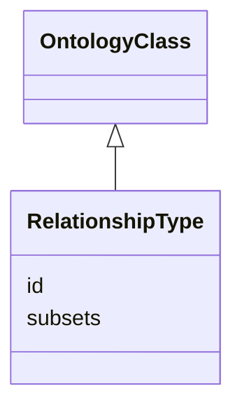

---
search:
  boost: 10.0
---

# Class: RelationshipType 


_An OWL property used as an edge label_


<div data-search-exclude markdown="1">


URI: [namo:RelationshipType](https://w3id.org/monarch-initiative/namo/RelationshipType)





## Inheritance
* [OntologyClass](OntologyClass.md)
    * **RelationshipType**


## Slots

| Name | Cardinality and Range | Description | Inheritance |
| ---  | --- | --- | --- |
| [id](id.md) | 1 <br/> [String](String.md) | A unique identifier for an entity | [OntologyClass](OntologyClass.md) |
| [subsets](subsets.md) | * <br/> [String](String.md) | The set of ontology subsets a term belongs to (e | [OntologyClass](OntologyClass.md) |


## Identifier and Mapping Information


### Schema Source


* from schema: https://w3id.org/monarch-initiative/namo


## Mappings

| Mapping Type | Mapped Value |
| ---  | ---  |
| self | namo:RelationshipType |
| native | namo:RelationshipType |


## LinkML Source

<!-- TODO: investigate https://stackoverflow.com/questions/37606292/how-to-create-tabbed-code-blocks-in-mkdocs-or-sphinx -->

### Direct

<details>
```yaml
name: relationship type
description: An OWL property used as an edge label
from_schema: https://w3id.org/monarch-initiative/namo
is_a: ontology class

```
</details>

### Induced

<details>
```yaml
name: relationship type
description: An OWL property used as an edge label
from_schema: https://w3id.org/monarch-initiative/namo
is_a: ontology class
attributes:
  id:
    name: id
    description: A unique identifier for an entity. Must be either a CURIE shorthand
      for a URI or a complete URI
    in_subset:
    - translator_minimal
    from_schema: https://w3id.org/monarch-initiative/namo
    exact_mappings:
    - AGRKB:primaryId
    - gff3:ID
    - gpi:DB_Object_ID
    rank: 1000
    domain: entity
    identifier: true
    owner: relationship type
    domain_of:
    - Reference
    - ontology class
    - entity
    range: string
    required: true
  subsets:
    name: subsets
    description: The set of ontology subsets a term belongs to (e.g. GO slim subsets,
      MONDO rare disease subset). Carries the values of `oboInOwl:inSubset` annotations
      from source ontologies through to downstream knowledge graphs.
    from_schema: https://w3id.org/monarch-initiative/namo
    exact_mappings:
    - oboInOwl:inSubset
    rank: 1000
    is_a: node property
    domain: named thing
    owner: relationship type
    domain_of:
    - ontology class
    range: string
    multivalued: true

```
</details></div>