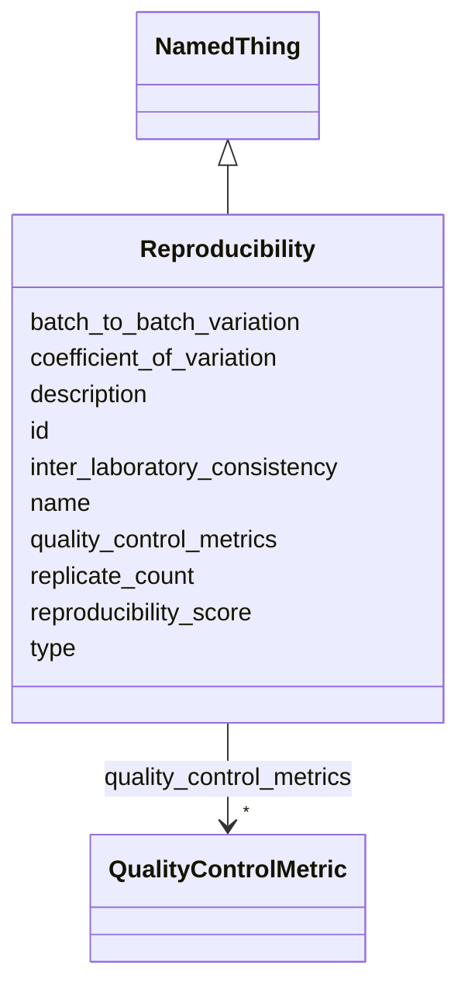

---
search:
  boost: 10.0
---

# Class: Reproducibility 


_Assessment of experimental reproducibility and consistency of the model system._


<div data-search-exclude markdown="1">


URI: [namo:Reproducibility](https://w3id.org/monarch-initiative/namo/Reproducibility)





## Inheritance
* [NamedThing](NamedThing.md)
    * **Reproducibility**


## Slots

| Name | Cardinality and Range | Description | Inheritance |
| ---  | --- | --- | --- |
| [reproducibility_score](reproducibility_score.md) | 0..1 <br/> [Float](Float.md) | Quantitative score (0 | direct |
| [coefficient_of_variation](coefficient_of_variation.md) | 0..1 <br/> [Float](Float.md) | Coefficient of variation across experimental replicates | direct |
| [batch_to_batch_variation](batch_to_batch_variation.md) | 0..1 <br/> [Float](Float.md) | Measure of variation between different experimental batches | direct |
| [inter_laboratory_consistency](inter_laboratory_consistency.md) | 0..1 <br/> [Float](Float.md) | Measure of consistency across different laboratories | direct |
| [replicate_count](replicate_count.md) | 0..1 <br/> [Integer](Integer.md) | Number of experimental replicates used in assessment | direct |
| [quality_control_metrics](quality_control_metrics.md) | * <br/> [QualityControlMetric](QualityControlMetric.md) | List of quality control measures and their values | direct |
| [id](id.md) | 1 <br/> [Uriorcurie](Uriorcurie.md) | A unique identifier for a thing | [NamedThing](NamedThing.md) |
| [name](name.md) | 0..1 <br/> [String](String.md) | A human-readable name for a thing | [NamedThing](NamedThing.md) |
| [description](description.md) | 0..1 <br/> [String](String.md) | A human-readable description for a thing | [NamedThing](NamedThing.md) |
| [type](type.md) | 0..1 <br/> [String](String.md) |  | [NamedThing](NamedThing.md) |


## Usages

| used by | used in | type | used |
| ---  | --- | --- | --- |
| [StructuredConcordanceResult](StructuredConcordanceResult.md) | [reproducibility](reproducibility.md) | range | [Reproducibility](Reproducibility.md) |


## Identifier and Mapping Information


### Schema Source


* from schema: https://w3id.org/monarch-initiative/namo


## Mappings

| Mapping Type | Mapped Value |
| ---  | ---  |
| self | namo:Reproducibility |
| native | namo:Reproducibility |


## LinkML Source

<!-- TODO: investigate https://stackoverflow.com/questions/37606292/how-to-create-tabbed-code-blocks-in-mkdocs-or-sphinx -->

### Direct

<details>
```yaml
name: Reproducibility
description: Assessment of experimental reproducibility and consistency of the model
  system.
from_schema: https://w3id.org/monarch-initiative/namo
is_a: NamedThing
attributes:
  reproducibility_score:
    name: reproducibility_score
    description: Quantitative score (0.0-1.0) representing reproducibility.
    from_schema: https://w3id.org/monarch-initiative/namo
    rank: 1000
    domain_of:
    - Reproducibility
    range: float
  coefficient_of_variation:
    name: coefficient_of_variation
    description: Coefficient of variation across experimental replicates.
    from_schema: https://w3id.org/monarch-initiative/namo
    rank: 1000
    domain_of:
    - Reproducibility
    range: float
  batch_to_batch_variation:
    name: batch_to_batch_variation
    description: Measure of variation between different experimental batches.
    from_schema: https://w3id.org/monarch-initiative/namo
    rank: 1000
    domain_of:
    - Reproducibility
    range: float
  inter_laboratory_consistency:
    name: inter_laboratory_consistency
    description: Measure of consistency across different laboratories.
    from_schema: https://w3id.org/monarch-initiative/namo
    rank: 1000
    domain_of:
    - Reproducibility
    range: float
  replicate_count:
    name: replicate_count
    description: Number of experimental replicates used in assessment.
    from_schema: https://w3id.org/monarch-initiative/namo
    rank: 1000
    domain_of:
    - Reproducibility
    range: integer
  quality_control_metrics:
    name: quality_control_metrics
    description: List of quality control measures and their values.
    from_schema: https://w3id.org/monarch-initiative/namo
    rank: 1000
    domain_of:
    - Reproducibility
    range: QualityControlMetric
    multivalued: true
    inlined_as_list: true

```
</details>

### Induced

<details>
```yaml
name: Reproducibility
description: Assessment of experimental reproducibility and consistency of the model
  system.
from_schema: https://w3id.org/monarch-initiative/namo
is_a: NamedThing
attributes:
  reproducibility_score:
    name: reproducibility_score
    description: Quantitative score (0.0-1.0) representing reproducibility.
    from_schema: https://w3id.org/monarch-initiative/namo
    rank: 1000
    owner: Reproducibility
    domain_of:
    - Reproducibility
    range: float
  coefficient_of_variation:
    name: coefficient_of_variation
    description: Coefficient of variation across experimental replicates.
    from_schema: https://w3id.org/monarch-initiative/namo
    rank: 1000
    owner: Reproducibility
    domain_of:
    - Reproducibility
    range: float
  batch_to_batch_variation:
    name: batch_to_batch_variation
    description: Measure of variation between different experimental batches.
    from_schema: https://w3id.org/monarch-initiative/namo
    rank: 1000
    owner: Reproducibility
    domain_of:
    - Reproducibility
    range: float
  inter_laboratory_consistency:
    name: inter_laboratory_consistency
    description: Measure of consistency across different laboratories.
    from_schema: https://w3id.org/monarch-initiative/namo
    rank: 1000
    owner: Reproducibility
    domain_of:
    - Reproducibility
    range: float
  replicate_count:
    name: replicate_count
    description: Number of experimental replicates used in assessment.
    from_schema: https://w3id.org/monarch-initiative/namo
    rank: 1000
    owner: Reproducibility
    domain_of:
    - Reproducibility
    range: integer
  quality_control_metrics:
    name: quality_control_metrics
    description: List of quality control measures and their values.
    from_schema: https://w3id.org/monarch-initiative/namo
    rank: 1000
    owner: Reproducibility
    domain_of:
    - Reproducibility
    range: QualityControlMetric
    multivalued: true
    inlined: true
    inlined_as_list: true
  id:
    name: id
    description: A unique identifier for a thing
    from_schema: https://w3id.org/monarch-initiative/namo
    rank: 1000
    slot_uri: schema:identifier
    identifier: true
    owner: Reproducibility
    domain_of:
    - NamedThing
    - Reference
    - BiolinkEntity
    range: uriorcurie
    required: true
  name:
    name: name
    description: A human-readable name for a thing
    from_schema: https://w3id.org/monarch-initiative/namo
    rank: 1000
    slot_uri: schema:name
    owner: Reproducibility
    domain_of:
    - NamedThing
    - BiolinkEntity
    range: string
  description:
    name: description
    description: A human-readable description for a thing
    from_schema: https://w3id.org/monarch-initiative/namo
    rank: 1000
    slot_uri: schema:description
    owner: Reproducibility
    domain_of:
    - NamedThing
    - BiolinkEntity
    range: string
  type:
    name: type
    from_schema: https://w3id.org/monarch-initiative/namo
    rank: 1000
    designates_type: true
    owner: Reproducibility
    domain_of:
    - NamedThing
    range: string

```
</details></div>