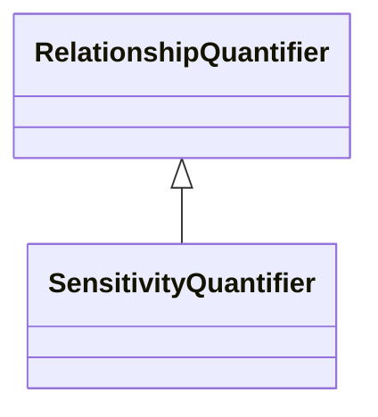

---
search:
  boost: 10.0
---

# Class: SensitivityQuantifier 


_A relationship quantifier that measures the sensitivity of a relationship, such as the proportion of true positives correctly identified in a diagnostic or association context._


<div data-search-exclude markdown="1">


URI: [namo:SensitivityQuantifier](https://w3id.org/monarch-initiative/namo/SensitivityQuantifier)





## Inheritance
* [RelationshipQuantifier](RelationshipQuantifier.md)
    * **SensitivityQuantifier**


## Class Properties

| Property | Value |
| --- | --- |
| Mixin | Yes |


## Slots

| Name | Cardinality and Range | Description | Inheritance |
| ---  | --- | --- | --- |


## Mixin Usage

| mixed into | description |
| --- | --- |


## Identifier and Mapping Information


### Schema Source


* from schema: https://w3id.org/monarch-initiative/namo


## Mappings

| Mapping Type | Mapped Value |
| ---  | ---  |
| self | namo:SensitivityQuantifier |
| native | namo:SensitivityQuantifier |


## LinkML Source

<!-- TODO: investigate https://stackoverflow.com/questions/37606292/how-to-create-tabbed-code-blocks-in-mkdocs-or-sphinx -->

### Direct

<details>
```yaml
name: sensitivity quantifier
description: A relationship quantifier that measures the sensitivity of a relationship,
  such as the proportion of true positives correctly identified in a diagnostic or
  association context.
from_schema: https://w3id.org/monarch-initiative/namo
is_a: relationship quantifier
mixin: true

```
</details>

### Induced

<details>
```yaml
name: sensitivity quantifier
description: A relationship quantifier that measures the sensitivity of a relationship,
  such as the proportion of true positives correctly identified in a diagnostic or
  association context.
from_schema: https://w3id.org/monarch-initiative/namo
is_a: relationship quantifier
mixin: true

```
</details></div>