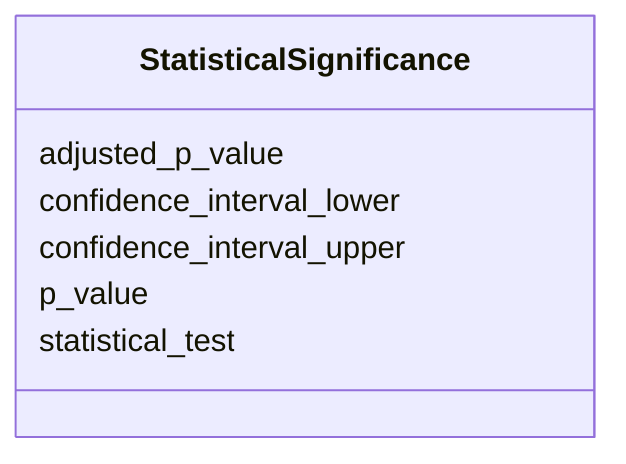

# Class: StatisticalSignificance 


_Statistical measures of significance for molecular comparisons._


URI: [namo:StatisticalSignificance](https://w3id.org/monarch-initiative/namo/StatisticalSignificance)





<!-- no inheritance hierarchy -->


## Slots

| Name | Cardinality and Range | Description | Inheritance |
| ---  | --- | --- | --- |
| [p_value](p_value.md) | 0..1 <br/> [Float](Float.md) | Statistical p-value | direct |
| [adjusted_p_value](adjusted_p_value.md) | 0..1 <br/> [Float](Float.md) | Multiple testing corrected p-value | direct |
| [confidence_interval_lower](confidence_interval_lower.md) | 0..1 <br/> [Float](Float.md) | Lower bound of confidence interval | direct |
| [confidence_interval_upper](confidence_interval_upper.md) | 0..1 <br/> [Float](Float.md) | Upper bound of confidence interval | direct |
| [statistical_test](statistical_test.md) | 0..1 <br/> [String](String.md) | Name of statistical test used | direct |


## Usages

| used by | used in | type | used |
| ---  | --- | --- | --- |
| [MolecularSimilarity](MolecularSimilarity.md) | [statistical_significance](statistical_significance.md) | range | [StatisticalSignificance](StatisticalSignificance.md) |


## Identifier and Mapping Information


### Schema Source


* from schema: https://w3id.org/monarch-initiative/namo


## Mappings

| Mapping Type | Mapped Value |
| ---  | ---  |
| self | namo:StatisticalSignificance |
| native | namo:StatisticalSignificance |


## LinkML Source

<!-- TODO: investigate https://stackoverflow.com/questions/37606292/how-to-create-tabbed-code-blocks-in-mkdocs-or-sphinx -->

### Direct

<details>
```yaml
name: StatisticalSignificance
description: Statistical measures of significance for molecular comparisons.
from_schema: https://w3id.org/monarch-initiative/namo
attributes:
  p_value:
    name: p_value
    description: Statistical p-value.
    from_schema: https://w3id.org/monarch-initiative/namo
    domain_of:
    - Gene
    - StatisticalSignificance
    - EnrichmentStatistics
    range: float
  adjusted_p_value:
    name: adjusted_p_value
    description: Multiple testing corrected p-value.
    from_schema: https://w3id.org/monarch-initiative/namo
    domain_of:
    - Gene
    - StatisticalSignificance
    range: float
  confidence_interval_lower:
    name: confidence_interval_lower
    description: Lower bound of confidence interval.
    from_schema: https://w3id.org/monarch-initiative/namo
    rank: 1000
    domain_of:
    - StatisticalSignificance
    range: float
  confidence_interval_upper:
    name: confidence_interval_upper
    description: Upper bound of confidence interval.
    from_schema: https://w3id.org/monarch-initiative/namo
    rank: 1000
    domain_of:
    - StatisticalSignificance
    range: float
  statistical_test:
    name: statistical_test
    description: Name of statistical test used.
    from_schema: https://w3id.org/monarch-initiative/namo
    rank: 1000
    domain_of:
    - StatisticalSignificance

```
</details>

### Induced

<details>
```yaml
name: StatisticalSignificance
description: Statistical measures of significance for molecular comparisons.
from_schema: https://w3id.org/monarch-initiative/namo
attributes:
  p_value:
    name: p_value
    description: Statistical p-value.
    from_schema: https://w3id.org/monarch-initiative/namo
    alias: p_value
    owner: StatisticalSignificance
    domain_of:
    - Gene
    - StatisticalSignificance
    - EnrichmentStatistics
    range: float
  adjusted_p_value:
    name: adjusted_p_value
    description: Multiple testing corrected p-value.
    from_schema: https://w3id.org/monarch-initiative/namo
    alias: adjusted_p_value
    owner: StatisticalSignificance
    domain_of:
    - Gene
    - StatisticalSignificance
    range: float
  confidence_interval_lower:
    name: confidence_interval_lower
    description: Lower bound of confidence interval.
    from_schema: https://w3id.org/monarch-initiative/namo
    rank: 1000
    alias: confidence_interval_lower
    owner: StatisticalSignificance
    domain_of:
    - StatisticalSignificance
    range: float
  confidence_interval_upper:
    name: confidence_interval_upper
    description: Upper bound of confidence interval.
    from_schema: https://w3id.org/monarch-initiative/namo
    rank: 1000
    alias: confidence_interval_upper
    owner: StatisticalSignificance
    domain_of:
    - StatisticalSignificance
    range: float
  statistical_test:
    name: statistical_test
    description: Name of statistical test used.
    from_schema: https://w3id.org/monarch-initiative/namo
    rank: 1000
    alias: statistical_test
    owner: StatisticalSignificance
    domain_of:
    - StatisticalSignificance
    range: string

```
</details>