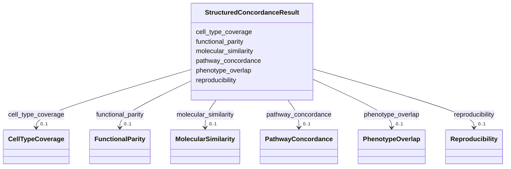

# Class: StructuredConcordanceResult 


_Detailed structured assessment of concordance between model and biological systems with rich metadata, evidence, and quantitative measures._


URI: [namo:StructuredConcordanceResult](https://w3id.org/monarch-initiative/namo/StructuredConcordanceResult)





<!-- no inheritance hierarchy -->


## Slots

| Name | Cardinality and Range | Description | Inheritance |
| ---  | --- | --- | --- |
| [molecular_similarity](molecular_similarity.md) | 0..1 <br/> [MolecularSimilarity](MolecularSimilarity.md) | Detailed assessment of molecular-level similarity including gene expression, ... | direct |
| [pathway_concordance](pathway_concordance.md) | 0..1 <br/> [PathwayConcordance](PathwayConcordance.md) | Assessment of biological pathway conservation and activity levels | direct |
| [phenotype_overlap](phenotype_overlap.md) | 0..1 <br/> [PhenotypeOverlap](PhenotypeOverlap.md) | Comparison of phenotypic manifestations between model and biological system | direct |
| [cell_type_coverage](cell_type_coverage.md) | 0..1 <br/> [CellTypeCoverage](CellTypeCoverage.md) | Assessment of cell type representation and cellular diversity | direct |
| [functional_parity](functional_parity.md) | 0..1 <br/> [FunctionalParity](FunctionalParity.md) | Evaluation of functional capabilities and physiological responses | direct |
| [reproducibility](reproducibility.md) | 0..1 <br/> [Reproducibility](Reproducibility.md) | Assessment of experimental reproducibility and consistency | direct |


## Usages

| used by | used in | type | used |
| ---  | --- | --- | --- |
| [ModelsRelationship](ModelsRelationship.md) | [structured_concordance](structured_concordance.md) | range | [StructuredConcordanceResult](StructuredConcordanceResult.md) |


## Identifier and Mapping Information


### Schema Source


* from schema: https://w3id.org/monarch-initiative/namo


## Mappings

| Mapping Type | Mapped Value |
| ---  | ---  |
| self | namo:StructuredConcordanceResult |
| native | namo:StructuredConcordanceResult |


## LinkML Source

<!-- TODO: investigate https://stackoverflow.com/questions/37606292/how-to-create-tabbed-code-blocks-in-mkdocs-or-sphinx -->

### Direct

<details>
```yaml
name: StructuredConcordanceResult
description: Detailed structured assessment of concordance between model and biological
  systems with rich metadata, evidence, and quantitative measures.
from_schema: https://w3id.org/monarch-initiative/namo
attributes:
  molecular_similarity:
    name: molecular_similarity
    description: Detailed assessment of molecular-level similarity including gene
      expression, protein levels, and metabolic profiles.
    from_schema: https://w3id.org/monarch-initiative/namo
    domain_of:
    - ConcordanceResult
    - StructuredConcordanceResult
    range: MolecularSimilarity
    inlined: true
  pathway_concordance:
    name: pathway_concordance
    description: Assessment of biological pathway conservation and activity levels.
    from_schema: https://w3id.org/monarch-initiative/namo
    domain_of:
    - ConcordanceResult
    - StructuredConcordanceResult
    range: PathwayConcordance
    inlined: true
  phenotype_overlap:
    name: phenotype_overlap
    description: Comparison of phenotypic manifestations between model and biological
      system.
    from_schema: https://w3id.org/monarch-initiative/namo
    domain_of:
    - ConcordanceResult
    - StructuredConcordanceResult
    range: PhenotypeOverlap
    inlined: true
  cell_type_coverage:
    name: cell_type_coverage
    description: Assessment of cell type representation and cellular diversity.
    from_schema: https://w3id.org/monarch-initiative/namo
    domain_of:
    - ConcordanceResult
    - StructuredConcordanceResult
    range: CellTypeCoverage
    inlined: true
  functional_parity:
    name: functional_parity
    description: Evaluation of functional capabilities and physiological responses.
    from_schema: https://w3id.org/monarch-initiative/namo
    domain_of:
    - ConcordanceResult
    - StructuredConcordanceResult
    range: FunctionalParity
    inlined: true
  reproducibility:
    name: reproducibility
    description: Assessment of experimental reproducibility and consistency.
    from_schema: https://w3id.org/monarch-initiative/namo
    domain_of:
    - ConcordanceResult
    - StructuredConcordanceResult
    range: Reproducibility
    inlined: true

```
</details>

### Induced

<details>
```yaml
name: StructuredConcordanceResult
description: Detailed structured assessment of concordance between model and biological
  systems with rich metadata, evidence, and quantitative measures.
from_schema: https://w3id.org/monarch-initiative/namo
attributes:
  molecular_similarity:
    name: molecular_similarity
    description: Detailed assessment of molecular-level similarity including gene
      expression, protein levels, and metabolic profiles.
    from_schema: https://w3id.org/monarch-initiative/namo
    alias: molecular_similarity
    owner: StructuredConcordanceResult
    domain_of:
    - ConcordanceResult
    - StructuredConcordanceResult
    range: MolecularSimilarity
    inlined: true
  pathway_concordance:
    name: pathway_concordance
    description: Assessment of biological pathway conservation and activity levels.
    from_schema: https://w3id.org/monarch-initiative/namo
    alias: pathway_concordance
    owner: StructuredConcordanceResult
    domain_of:
    - ConcordanceResult
    - StructuredConcordanceResult
    range: PathwayConcordance
    inlined: true
  phenotype_overlap:
    name: phenotype_overlap
    description: Comparison of phenotypic manifestations between model and biological
      system.
    from_schema: https://w3id.org/monarch-initiative/namo
    alias: phenotype_overlap
    owner: StructuredConcordanceResult
    domain_of:
    - ConcordanceResult
    - StructuredConcordanceResult
    range: PhenotypeOverlap
    inlined: true
  cell_type_coverage:
    name: cell_type_coverage
    description: Assessment of cell type representation and cellular diversity.
    from_schema: https://w3id.org/monarch-initiative/namo
    alias: cell_type_coverage
    owner: StructuredConcordanceResult
    domain_of:
    - ConcordanceResult
    - StructuredConcordanceResult
    range: CellTypeCoverage
    inlined: true
  functional_parity:
    name: functional_parity
    description: Evaluation of functional capabilities and physiological responses.
    from_schema: https://w3id.org/monarch-initiative/namo
    alias: functional_parity
    owner: StructuredConcordanceResult
    domain_of:
    - ConcordanceResult
    - StructuredConcordanceResult
    range: FunctionalParity
    inlined: true
  reproducibility:
    name: reproducibility
    description: Assessment of experimental reproducibility and consistency.
    from_schema: https://w3id.org/monarch-initiative/namo
    alias: reproducibility
    owner: StructuredConcordanceResult
    domain_of:
    - ConcordanceResult
    - StructuredConcordanceResult
    range: Reproducibility
    inlined: true

```
</details>