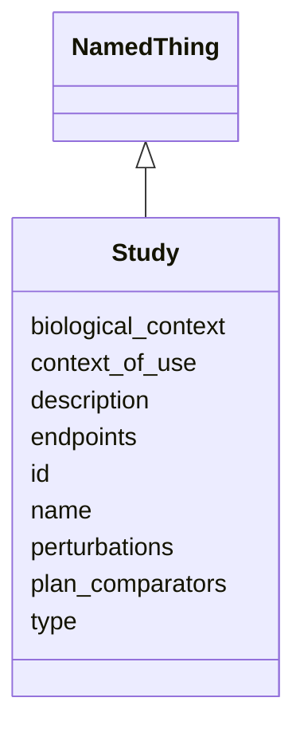

# Class: Study 


_A study is a structured investigation or analysis, often involving the collection and interpretation of data, to answer specific research questions or test hypotheses._


URI: [namo:Study](https://w3id.org/monarch-initiative/namo/Study)





## Inheritance
* [NamedThing](NamedThing.md)
    * **Study**


## Slots

| Name | Cardinality and Range | Description | Inheritance |
| ---  | --- | --- | --- |
| [context_of_use](context_of_use.md) | 0..1 <br/> [String](String.md) | What decision will this inform? Care? Policy? Drug approval? | direct |
| [biological_context](biological_context.md) | 0..1 <br/> [String](String.md) | tissue/region (anatomy), cell types, sex/age equivalents, mechanics (e | direct |
| [perturbations](perturbations.md) | 0..1 <br/> [String](String.md) | exposure/dose/time; diet/drugs/toxicants | direct |
| [endpoints](endpoints.md) | 0..1 <br/> [String](String.md) | phenotypes, function (TEER/leak, beating rate), and multi-omics | direct |
| [plan_comparators](plan_comparators.md) | 0..1 <br/> [String](String.md) | human data, gold-standard assays, or high-quality animal references | direct |
| [id](id.md) | 1 <br/> [Uriorcurie](Uriorcurie.md) | A unique identifier for a thing | [NamedThing](NamedThing.md) |
| [name](name.md) | 0..1 <br/> [String](String.md) | A human-readable name for a thing | [NamedThing](NamedThing.md) |
| [description](description.md) | 0..1 <br/> [String](String.md) | A human-readable description for a thing | [NamedThing](NamedThing.md) |
| [type](type.md) | 0..1 <br/> [String](String.md) |  | [NamedThing](NamedThing.md) |


## Usages

| used by | used in | type | used |
| ---  | --- | --- | --- |
| [Dataset](Dataset.md) | [studies](studies.md) | range | [Study](Study.md) |


## Identifier and Mapping Information


### Schema Source


* from schema: https://w3id.org/monarch-initiative/namo


## Mappings

| Mapping Type | Mapped Value |
| ---  | ---  |
| self | namo:Study |
| native | namo:Study |


## LinkML Source

<!-- TODO: investigate https://stackoverflow.com/questions/37606292/how-to-create-tabbed-code-blocks-in-mkdocs-or-sphinx -->

### Direct

<details>
```yaml
name: Study
description: A study is a structured investigation or analysis, often involving the
  collection and interpretation of data, to answer specific research questions or
  test hypotheses.
from_schema: https://w3id.org/monarch-initiative/namo
is_a: NamedThing
attributes:
  context_of_use:
    name: context_of_use
    description: What decision will this inform? Care? Policy? Drug approval?
    from_schema: https://w3id.org/monarch-initiative/namo
    rank: 1000
    domain_of:
    - Study
  biological_context:
    name: biological_context
    description: tissue/region (anatomy), cell types, sex/age equivalents, mechanics
      (e.g., cyclic stretch), microenvironment
    from_schema: https://w3id.org/monarch-initiative/namo
    rank: 1000
    domain_of:
    - Study
  perturbations:
    name: perturbations
    description: exposure/dose/time; diet/drugs/toxicants
    from_schema: https://w3id.org/monarch-initiative/namo
    rank: 1000
    domain_of:
    - Study
  endpoints:
    name: endpoints
    description: phenotypes, function (TEER/leak, beating rate), and multi-omics
    from_schema: https://w3id.org/monarch-initiative/namo
    rank: 1000
    domain_of:
    - Study
  plan_comparators:
    name: plan_comparators
    description: human data, gold-standard assays, or high-quality animal references
    from_schema: https://w3id.org/monarch-initiative/namo
    rank: 1000
    domain_of:
    - Study

```
</details>

### Induced

<details>
```yaml
name: Study
description: A study is a structured investigation or analysis, often involving the
  collection and interpretation of data, to answer specific research questions or
  test hypotheses.
from_schema: https://w3id.org/monarch-initiative/namo
is_a: NamedThing
attributes:
  context_of_use:
    name: context_of_use
    description: What decision will this inform? Care? Policy? Drug approval?
    from_schema: https://w3id.org/monarch-initiative/namo
    rank: 1000
    alias: context_of_use
    owner: Study
    domain_of:
    - Study
    range: string
  biological_context:
    name: biological_context
    description: tissue/region (anatomy), cell types, sex/age equivalents, mechanics
      (e.g., cyclic stretch), microenvironment
    from_schema: https://w3id.org/monarch-initiative/namo
    rank: 1000
    alias: biological_context
    owner: Study
    domain_of:
    - Study
    range: string
  perturbations:
    name: perturbations
    description: exposure/dose/time; diet/drugs/toxicants
    from_schema: https://w3id.org/monarch-initiative/namo
    rank: 1000
    alias: perturbations
    owner: Study
    domain_of:
    - Study
    range: string
  endpoints:
    name: endpoints
    description: phenotypes, function (TEER/leak, beating rate), and multi-omics
    from_schema: https://w3id.org/monarch-initiative/namo
    rank: 1000
    alias: endpoints
    owner: Study
    domain_of:
    - Study
    range: string
  plan_comparators:
    name: plan_comparators
    description: human data, gold-standard assays, or high-quality animal references
    from_schema: https://w3id.org/monarch-initiative/namo
    rank: 1000
    alias: plan_comparators
    owner: Study
    domain_of:
    - Study
    range: string
  id:
    name: id
    description: A unique identifier for a thing
    from_schema: https://w3id.org/monarch-initiative/namo
    rank: 1000
    slot_uri: schema:identifier
    identifier: true
    alias: id
    owner: Study
    domain_of:
    - NamedThing
    - Reference
    range: uriorcurie
    required: true
  name:
    name: name
    description: A human-readable name for a thing
    from_schema: https://w3id.org/monarch-initiative/namo
    rank: 1000
    slot_uri: schema:name
    alias: name
    owner: Study
    domain_of:
    - NamedThing
    range: string
  description:
    name: description
    description: A human-readable description for a thing
    from_schema: https://w3id.org/monarch-initiative/namo
    rank: 1000
    slot_uri: schema:description
    alias: description
    owner: Study
    domain_of:
    - NamedThing
    range: string
  type:
    name: type
    from_schema: https://w3id.org/monarch-initiative/namo
    rank: 1000
    designates_type: true
    alias: type
    owner: Study
    domain_of:
    - NamedThing
    range: string

```
</details>