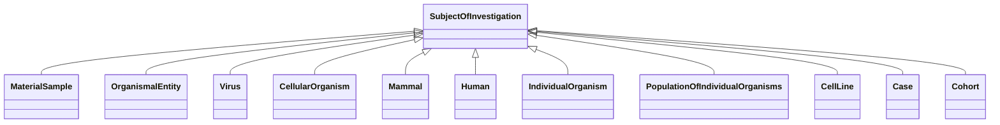

---
search:
  boost: 10.0
---

# Class: SubjectOfInvestigation 


_An entity that has the role of being studied in an investigation, study, or experiment_


<div data-search-exclude markdown="1">


URI: [namo:SubjectOfInvestigation](https://w3id.org/monarch-initiative/namo/SubjectOfInvestigation)





<!-- no inheritance hierarchy -->

## Class Properties

| Property | Value |
| --- | --- |
| Mixin | Yes |


## Slots

| Name | Cardinality and Range | Description | Inheritance |
| ---  | --- | --- | --- |


## Mixin Usage

| mixed into | description |
| --- | --- |
| [MaterialSample](MaterialSample.md) | A sample is a limited quantity of something (e |
| [OrganismalEntity](OrganismalEntity.md) | A named entity that is either a part of an organism, a whole organism, popula... |
| [Virus](Virus.md) | A virus is a microorganism that replicates itself as a microRNA and infects t... |
| [CellularOrganism](CellularOrganism.md) | An organism that contains one or more cells belonging to the cellular lineage... |
| [Mammal](Mammal.md) |  |
| [Human](Human.md) |  |
| [IndividualOrganism](IndividualOrganism.md) | An instance of an organism |
| [PopulationOfIndividualOrganisms](PopulationOfIndividualOrganisms.md) | A collection of individuals from the same taxonomic class distinguished by on... |
| [CellLine](CellLine.md) | A cultured cell population that is genetically stable and homogeneous, sharin... |
| [Case](Case.md) | An individual (human) organism that has a patient role in some clinical conte... |
| [Cohort](Cohort.md) | A group of people banded together or treated as a group who share common char... |


## Identifier and Mapping Information


### Schema Source


* from schema: https://w3id.org/monarch-initiative/namo


## Mappings

| Mapping Type | Mapped Value |
| ---  | ---  |
| self | namo:SubjectOfInvestigation |
| native | namo:SubjectOfInvestigation |


## LinkML Source

<!-- TODO: investigate https://stackoverflow.com/questions/37606292/how-to-create-tabbed-code-blocks-in-mkdocs-or-sphinx -->

### Direct

<details>
```yaml
name: subject of investigation
description: An entity that has the role of being studied in an investigation, study,
  or experiment
from_schema: https://w3id.org/monarch-initiative/namo
mixin: true

```
</details>

### Induced

<details>
```yaml
name: subject of investigation
description: An entity that has the role of being studied in an investigation, study,
  or experiment
from_schema: https://w3id.org/monarch-initiative/namo
mixin: true

```
</details></div>