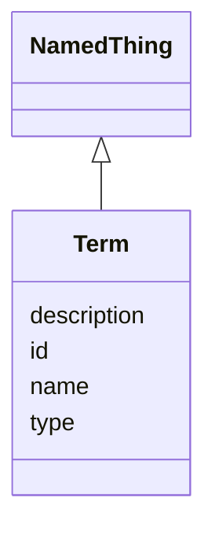

# Class: Term 


_A term is a concept or entity that can be defined and used in a specific context, often within a controlled vocabulary or ontology._


URI: [namo:Term](https://w3id.org/monarch-initiative/namo/Term)





## Inheritance
* [NamedThing](NamedThing.md)
    * **Term**


## Slots

| Name | Cardinality and Range | Description | Inheritance |
| ---  | --- | --- | --- |
| [id](id.md) | 1 <br/> [Uriorcurie](Uriorcurie.md) | A unique identifier for a thing | [NamedThing](NamedThing.md) |
| [name](name.md) | 0..1 <br/> [String](String.md) | A human-readable name for a thing | [NamedThing](NamedThing.md) |
| [description](description.md) | 0..1 <br/> [String](String.md) | A human-readable description for a thing | [NamedThing](NamedThing.md) |
| [type](type.md) | 0..1 <br/> [String](String.md) |  | [NamedThing](NamedThing.md) |


## Usages

| used by | used in | type | used |
| ---  | --- | --- | --- |
| [AnimalModel](AnimalModel.md) | [species](species.md) | range | [Term](Term.md) |
| [AnimalModel](AnimalModel.md) | [strain](strain.md) | range | [Term](Term.md) |
| [AnimalModel](AnimalModel.md) | [age](age.md) | range | [Term](Term.md) |
| [AnimalModel](AnimalModel.md) | [environment](environment.md) | range | [Term](Term.md) |
| [CellularSystem](CellularSystem.md) | [cell_types](cell_types.md) | range | [Term](Term.md) |
| [TwoDCellCulture](TwoDCellCulture.md) | [cell_types](cell_types.md) | range | [Term](Term.md) |
| [ThreeDCellCulture](ThreeDCellCulture.md) | [cell_types](cell_types.md) | range | [Term](Term.md) |
| [CoCulture](CoCulture.md) | [cell_types](cell_types.md) | range | [Term](Term.md) |
| [Organoid](Organoid.md) | [organ_modeled](organ_modeled.md) | range | [Term](Term.md) |
| [Organoid](Organoid.md) | [cell_types](cell_types.md) | range | [Term](Term.md) |
| [CellLineModel](CellLineModel.md) | [cell_types](cell_types.md) | range | [Term](Term.md) |
| [OrganOnChip](OrganOnChip.md) | [organ_modeled](organ_modeled.md) | range | [Term](Term.md) |
| [OrganOnChip](OrganOnChip.md) | [cell_types](cell_types.md) | range | [Term](Term.md) |
| [TissueOnChip](TissueOnChip.md) | [tissue_modeled](tissue_modeled.md) | range | [Term](Term.md) |
| [PBPKModel](PBPKModel.md) | [species_modeled](species_modeled.md) | range | [Term](Term.md) |
| [CellRatio](CellRatio.md) | [cell_type](cell_type.md) | range | [Term](Term.md) |
| [PhenotypeOverlap](PhenotypeOverlap.md) | [shared_phenotypes](shared_phenotypes.md) | range | [Term](Term.md) |
| [PhenotypeOverlap](PhenotypeOverlap.md) | [model_specific_phenotypes](model_specific_phenotypes.md) | range | [Term](Term.md) |
| [PhenotypeOverlap](PhenotypeOverlap.md) | [biological_specific_phenotypes](biological_specific_phenotypes.md) | range | [Term](Term.md) |
| [CellTypeCoverage](CellTypeCoverage.md) | [represented_cell_types](represented_cell_types.md) | range | [Term](Term.md) |
| [CellTypeCoverage](CellTypeCoverage.md) | [missing_cell_types](missing_cell_types.md) | range | [Term](Term.md) |
| [CellTypeProportion](CellTypeProportion.md) | [cell_type](cell_type.md) | range | [Term](Term.md) |


## Identifier and Mapping Information


### Schema Source


* from schema: https://w3id.org/monarch-initiative/namo


## Mappings

| Mapping Type | Mapped Value |
| ---  | ---  |
| self | namo:Term |
| native | namo:Term |


## LinkML Source

<!-- TODO: investigate https://stackoverflow.com/questions/37606292/how-to-create-tabbed-code-blocks-in-mkdocs-or-sphinx -->

### Direct

<details>
```yaml
name: Term
description: A term is a concept or entity that can be defined and used in a specific
  context, often within a controlled vocabulary or ontology.
from_schema: https://w3id.org/monarch-initiative/namo
is_a: NamedThing

```
</details>

### Induced

<details>
```yaml
name: Term
description: A term is a concept or entity that can be defined and used in a specific
  context, often within a controlled vocabulary or ontology.
from_schema: https://w3id.org/monarch-initiative/namo
is_a: NamedThing
attributes:
  id:
    name: id
    description: A unique identifier for a thing
    from_schema: https://w3id.org/monarch-initiative/namo
    rank: 1000
    slot_uri: schema:identifier
    identifier: true
    alias: id
    owner: Term
    domain_of:
    - NamedThing
    - Reference
    range: uriorcurie
    required: true
  name:
    name: name
    description: A human-readable name for a thing
    from_schema: https://w3id.org/monarch-initiative/namo
    rank: 1000
    slot_uri: schema:name
    alias: name
    owner: Term
    domain_of:
    - NamedThing
    range: string
  description:
    name: description
    description: A human-readable description for a thing
    from_schema: https://w3id.org/monarch-initiative/namo
    rank: 1000
    slot_uri: schema:description
    alias: description
    owner: Term
    domain_of:
    - NamedThing
    range: string
  type:
    name: type
    from_schema: https://w3id.org/monarch-initiative/namo
    rank: 1000
    designates_type: true
    alias: type
    owner: Term
    domain_of:
    - NamedThing
    range: string

```
</details>