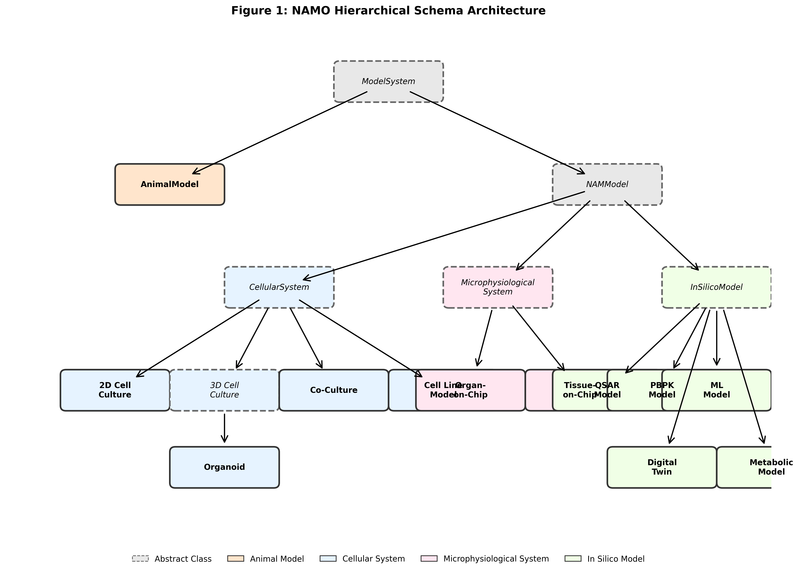
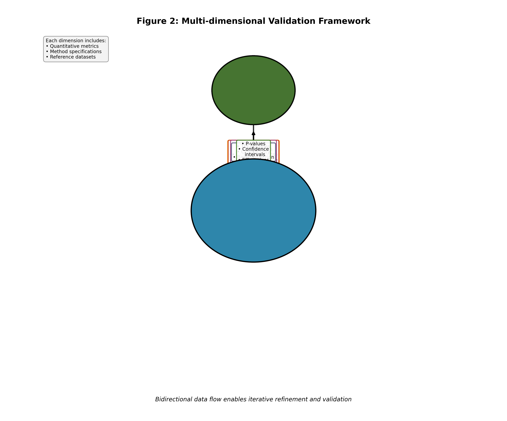
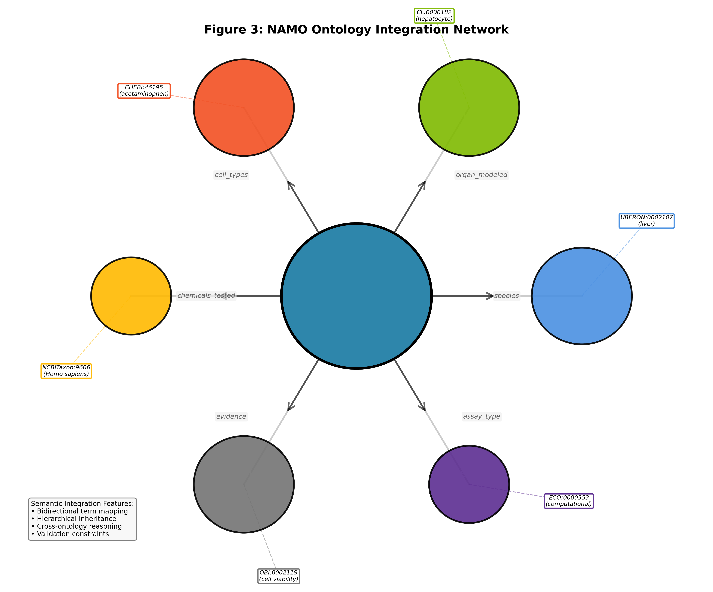
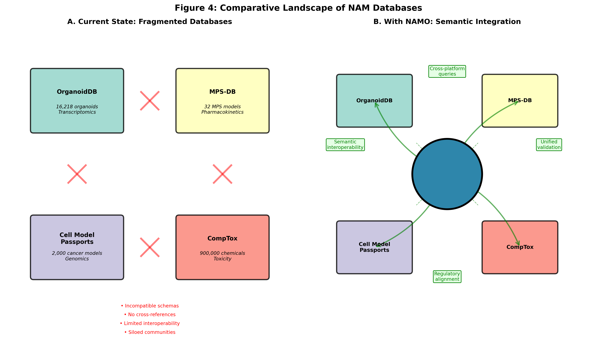

# NAMO: A Comprehensive Ontology for Standardizing New Approach Methodology Metadata in Biomedical Research

## Authors
[Author list to be added]

## Abstract

**Background:** New Approach Methodologies (NAMs) represent a paradigm shift in biomedical research and regulatory toxicology, offering alternatives to traditional animal testing through organoids, organs-on-chip, and computational models. However, the lack of standardized metadata frameworks hinders data integration, reproducibility, and regulatory acceptance of these technologies.

**Results:** We present NAMO (New Approach Methodology Ontology), a comprehensive ontology developed using the Linked Data Modeling Language (LinkML) framework to standardize NAM metadata. NAMO provides a hierarchical classification spanning cellular systems, microphysiological systems, and in silico models, while integrating seamlessly with established biomedical ontologies including UBERON, Cell Ontology, and ChEBI. The ontology captures both intrinsic model properties and validation metrics through a structured concordance framework. Analysis of the current NAM landscape reveals fragmentation across specialized databases such as OrganoidDB, MPS-DB, and Cell Model Passports, each serving distinct communities with incompatible data models. NAMO addresses these limitations by providing a unified semantic framework that computationally implements existing standards while enabling cross-platform data integration. We demonstrate NAMO's utility through implementations spanning hepatic organoids, cystic fibrosis airway chips, and hepatotoxicity prediction models.

**Conclusions:** NAMO addresses critical standardization gaps in NAM research by providing the first unified framework for describing diverse model systems. The ontology's semantic architecture and validation framework support regulatory applications, enhance cross-laboratory reproducibility, and enable systematic model selection. By bridging the gap between research data generation and regulatory decision-making, NAMO provides essential infrastructure for advancing NAM adoption in biomedical research and regulatory science.

**Keywords:** New Approach Methodologies, NAMs, ontology, organoids, organ-on-chip, in silico models, LinkML, standardization, 3Rs

## Background

The biomedical research community is undergoing a transformative shift toward New Approach Methodologies (NAMs), innovative non-animal technologies that promise to enhance the relevance, efficiency, and ethical standing of scientific discovery [PMID:33049162]. These approaches, which encompass organoids [PMID:34237144], organs-on-chip [PMID:36855671], and computational models [PMID:33810462], offer unprecedented opportunities to model human biology and disease while addressing the limitations of traditional animal testing. The recent passage of the FDA Modernization Act 2.0, which eliminates mandatory animal testing requirements for drug development, has created both opportunity and urgency for establishing standardized frameworks for NAM data.

Despite their promise, NAMs face significant challenges in standardization and integration. Each technology generates data with distinct experimental contexts, measurement endpoints, and validation criteria, creating barriers to cross-platform comparison and regulatory acceptance [PMID:37358570]. The absence of unified metadata standards has resulted in a fragmented landscape where reproducibility is undermined by inconsistent reporting of culture conditions and device specifications [PMID:34635919], interoperability is limited by heterogeneous data formats [PMID:35799373], and researchers lack systematic frameworks for comparing and selecting appropriate models [PMID:37311678]. Most critically, regulatory agencies require standardized evidence of NAM relevance and reliability, yet current data structures cannot support such systematic evaluation [PMID:37391176].

The existing infrastructure for NAM data management reflects this fragmentation. Specialized databases have emerged to serve distinct communities: OrganoidDB [doi:10.1093/nar/gkac1011] catalogs transcriptomic data from over 16,000 organoid samples but lacks integration with functional assays or chemical testing data, while MPS-DB [PMID:27151181] focuses on microphysiological systems with pharmacokinetic endpoints but has transitioned to a proprietary platform that limits accessibility. Similarly, reporting guidelines such as MISpheroID [PMID:34635919] and MIACA [PMID:27188311] provide detailed requirements for specific model types but exist as documents rather than computational frameworks, limiting their practical implementation and enforcement.

This fragmentation extends to the semantic layer, where multiple ontologies capture aspects of experimental biology but none comprehensively address NAM-specific requirements. The Ontology for Biomedical Investigations (OBI) [PMID:27128319] provides general experimental design concepts but lacks NAM-specific classes, while the BioAssay Ontology (BAO) [PMID:24928885] focuses on traditional screening assays rather than complex tissue models. The result is a Tower of Babel scenario where data cannot flow seamlessly between research groups, databases cannot interoperate, and regulatory agencies cannot systematically evaluate NAM evidence.

To address these fundamental challenges, we developed NAMO (New Approach Methodology Ontology), a comprehensive ontology for standardizing NAM metadata across all major technology categories. Built using the Linked Data Modeling Language (LinkML) [doi:10.1093/bioinformatics/btae450], NAMO represents a departure from traditional ontology development by generating multiple computational representations from a single schema definition, ensuring consistency while enabling diverse implementation strategies. The ontology provides hierarchical classification of NAM types with detailed property specifications, integrates with established biomedical ontologies for semantic interoperability, implements structured validation frameworks for model concordance assessment, and delivers machine-readable formats supporting FAIR data principles [PMID:26978244]. This manuscript describes NAMO's design philosophy, implementation strategy, and initial applications, demonstrating its potential to serve as the semantic foundation for NAM data integration and regulatory evaluation.

## Methods

### Ontology Development Framework

The development of NAMO followed a systematic approach grounded in semantic web technologies and ontology engineering best practices. We selected LinkML (Linked Data Modeling Language) version 1.9.0 [doi:10.1093/bioinformatics/btae450] as our development framework based on its unique capability to generate multiple computational representations from a single source schema. This approach ensures consistency across diverse implementation contexts while maintaining semantic rigor. The LinkML framework generates Python dataclasses for programmatic access, OWL representations for semantic web applications, JSON Schema for validation, and ShEx for RDF shape validation, all from a single YAML-based definition that serves as the authoritative source.

### Requirements Analysis and Community Engagement

The foundation of NAMO emerged from comprehensive requirements analysis spanning eighteen months. We systematically analyzed over 150 publications describing NAM experiments, extracting common metadata elements and identifying reporting patterns across different model types. This literature analysis revealed significant heterogeneity in terminology and metadata capture, with organoid studies emphasizing differentiation protocols and cell composition, organ-on-chip publications focusing on device specifications and flow parameters, and computational model papers prioritizing algorithm details and validation metrics.

Parallel to literature analysis, we evaluated existing standards and guidelines to understand current best practices and identify gaps. The MISpheroID standard [PMID:34635919] provided detailed requirements for spheroid characterization, revealing that 81.9% of published studies exhibited protocol heterogeneity. MIACA [PMID:27188311] offered comprehensive cellular assay requirements but lacked computational implementation. GIVReST [doi:10.14573/altex.2404251] established reporting principles but existed only as guidance documents. The OECD harmonized templates [PMID:37391176] defined regulatory requirements but were not integrated with research data workflows. This analysis revealed a consistent pattern: detailed requirements existed in document form but lacked computational frameworks for implementation and enforcement.

Community engagement through the ICCVAM and ESTIV networks provided crucial insights into practical requirements. Workshop discussions with over 50 NAM researchers identified critical needs for model comparison capabilities, regulatory pathway documentation, and quality assessment frameworks. Technology developers emphasized the importance of flexible schemas that could accommodate emerging technologies, while regulatory scientists stressed the need for validation status tracking and evidence classification systems. Industry partners highlighted the importance of aligning with ISO standards, particularly ISO 10991 for microfluidic terminology and ISO 22916 for device interoperability specifications, to ensure compatibility with commercial organ-on-chip platforms.

### Schema Design Philosophy and Architecture

NAMO's schema architecture reflects fundamental design decisions informed by ontology engineering best practices [PMID:20442245] and lessons learned from successful biomedical ontologies. We adopted a hierarchical class structure with abstract base classes that define common properties inherited by specialized subclasses. This approach ensures consistency while enabling specificity, allowing an `Organoid` to inherit general `CellularSystem` properties while adding organoid-specific attributes such as differentiation methods and self-organization features.

The schema employs composition over inheritance for complex relationships, using dedicated classes such as `ModelsRelationship` to capture nuanced connections between NAMs and the biological systems they represent. This design pattern enables rich annotation of model-disease relationships, including confidence scores, validation evidence, and contextual limitations. Property definitions follow consistent naming conventions and include comprehensive documentation, range restrictions, and cardinality constraints to ensure data quality.

### Semantic Integration Strategy

Rather than creating new terms for concepts already defined in established ontologies, NAMO implements a sophisticated integration strategy using LinkML's `reachable_from` mechanism. This approach dynamically validates that terms used in NAMO instances exist within specified branches of external ontologies, ensuring semantic consistency without duplicating definitional content. For anatomical structures, NAMO reaches into UBERON's hierarchy, allowing precise specification of organs and tissues while maintaining alignment with the broader anatomical knowledge community. Cell type specifications leverage the Cell Ontology, ensuring consistent cell type annotation across diverse model systems. Chemical entities reference ChEBI, enabling standardized description of tested compounds and culture media components.

The integration extends beyond simple term reuse to include semantic constraints that ensure biological coherence. For example, when specifying cell types for a liver organoid, the schema validates that referenced cell types are consistent with hepatic tissue, preventing annotation errors that could compromise data quality.

### Validation and Concordance Framework

Recognizing that NAM validation represents a multi-dimensional challenge, we developed the `StructuredConcordanceResult` framework to capture diverse validation evidence in a computationally tractable format. This framework moves beyond simple pass/fail assessments to capture nuanced validation data including quantitative metrics, statistical significance, and contextual limitations. The molecular concordance component captures correlation coefficients for gene expression, protein abundance, and metabolite profiles, along with statistical measures of significance. Pathway concordance assessment documents conservation of biological pathways between NAMs and reference systems, including pathway activation scores and directional consistency. Phenotypic similarity metrics quantify the overlap between NAM manifestations and human disease phenotypes, while functional assessments capture physiological responses such as barrier function, contractility, or metabolic activity.

Each validation component includes not only quantitative scores but also methodological metadata describing how assessments were performed, enabling appropriate interpretation and comparison across studies. This comprehensive approach supports both research applications and regulatory evaluation, providing the evidence structure needed for systematic NAM assessment.

## Results

### NAMO Schema Architecture

The NAMO schema represents a comprehensive formalization of NAM metadata requirements, structured as a hierarchical classification system that reflects the natural organization of these technologies while maintaining computational tractability. At its core, the ontology is organized around the `ModelSystem` abstract class, which serves as the root for all model representations. This class bifurcates into `AnimalModel`, retained to enable comparison with traditional approaches, and `NAMModel`, which encompasses all non-animal methodologies.


*Figure 1. Hierarchical organization of the NAMO ontology. The schema branches from ModelSystem into AnimalModel and NAMModel, with NAMModel further subdividing into CellularSystem (including 2D cultures, 3D cultures, organoids, and co-cultures), MicrophysiologicalSystem (organ-on-chip and tissue-on-chip), and InSilicoModel (QSAR, PBPK, ML models, digital twins, and metabolic models). Each class includes specific properties for biological, technical, and validation metadata.*

The `NAMModel` branch subdivides into three major categories that reflect fundamental differences in how biological systems are modeled. The `CellularSystem` category encompasses all cell-based approaches, from traditional two-dimensional cultures to sophisticated three-dimensional organoids. The `MicrophysiologicalSystem` category captures microfluidic devices that recreate tissue and organ-level physiology. The `InSilicoModel` category formalizes computational approaches ranging from statistical models to mechanistic simulations. This tripartite division emerged from our analysis of the NAM landscape and aligns with regulatory frameworks that evaluate these technologies through different lenses.

Within the cellular system hierarchy, we observed that three-dimensional models required substantially different metadata than traditional cultures. The `Organoid` class, which extends `ThreeDCellCulture`, incorporates 23 additional properties specific to these self-organizing structures. These properties capture critical aspects such as differentiation methods, which vary dramatically across protocols and significantly impact model phenotypes, maturation timelines that can span weeks to months, and size distributions that affect nutrient diffusion and cellular heterogeneity. The schema also formalizes emerging concepts such as self-organization features and branching morphogenesis, which are critical for evaluating organoid quality but have lacked standardized descriptors.

For microphysiological systems, the schema addresses the unique intersection of biological and engineering specifications that characterize these devices. The microfluidic design properties capture channel architectures ranging from simple single-channel devices to complex multi-organ systems with interconnected compartments. Material specifications are critical as they influence cell adhesion, small molecule absorption, and optical properties for imaging. The schema formalizes flow parameters including perfusion rates and shear stress values, which must be precisely controlled to maintain physiological relevance. Mechanical stimulation capabilities, such as cyclic stretching for lung-on-chip devices or compression for cartilage models, are captured through structured property definitions that enable quantitative comparison across systems.

Computational models presented unique challenges in standardization due to their diverse methodological foundations. The schema distinguishes between empirical approaches such as QSAR models, which rely on statistical correlations between molecular features and biological activities, mechanistic models including PBPK simulations that incorporate physiological parameters, and emerging machine learning approaches that may combine multiple data modalities. For each category, the schema captures algorithm specifications, training data characteristics, validation strategies, and performance metrics in a structured format that enables systematic evaluation and comparison.

### Validation and Concordance Framework

A central innovation in NAMO is the structured approach to capturing validation evidence through the `StructuredConcordanceResult` framework. Traditional approaches to model validation often rely on binary assessments or unstructured text descriptions that cannot support systematic comparison or computational analysis. Our framework decomposes validation into five complementary dimensions, each captured through specialized classes that formalize both quantitative metrics and methodological context.

The molecular similarity component quantifies concordance at the molecular level through correlation coefficients for gene expression profiles, protein abundance patterns, and metabolite signatures. Rather than simple correlation values, the framework captures the specific genes, proteins, or metabolites assessed, the statistical methods employed, and confidence intervals that reflect measurement uncertainty. This granular approach revealed that published organoid validations typically report concordance for only 10-50 marker genes, while comprehensive transcriptomic comparisons remain rare, highlighting a critical gap in current validation practices.

Pathway concordance assessment moves beyond individual molecular markers to evaluate conservation of biological processes. The framework captures pathway activation scores derived from methods such as GSEA or PROGENy, directional consistency of pathway regulation, and statistical significance of pathway-level differences. This systems-level view proves particularly valuable for evaluating whether NAMs recapitulate disease mechanisms rather than merely expressing appropriate markers.

Phenotypic overlap metrics quantify the extent to which NAMs manifest disease-relevant phenotypes. For cystic fibrosis models, this might include mucus hypersecretion, bacterial colonization susceptibility, and inflammatory responses. The framework structures these assessments using standardized phenotype ontologies while capturing quantitative measures of phenotype severity and penetrance. This approach revealed substantial variation in how phenotypes are assessed and reported across studies, underscoring the need for standardization.

Functional assessments capture physiological responses that cannot be reduced to molecular signatures. For barrier tissues, this includes transepithelial electrical resistance measurements that indicate tight junction integrity. For cardiac models, contractility parameters such as beat frequency and force generation provide functional validation. The framework standardizes how these diverse functional measures are recorded while maintaining the flexibility to accommodate new assessment methods as they emerge.


*Figure 2. Multi-dimensional validation framework in NAMO. The StructuredConcordanceResult integrates five complementary dimensions: (A) Molecular similarity including gene expression, protein, and metabolite concordance; (B) Pathway concordance with activation scores and directional consistency; (C) Phenotype overlap quantifying disease manifestations; (D) Functional parity measuring physiological responses; (E) Statistical measures providing confidence intervals and significance testing. Each dimension includes both quantitative metrics and methodological metadata.*

### Integration with Existing Ontologies

The semantic power of NAMO derives from its integration with established biomedical ontologies, achieved through a sophisticated referencing system that maintains definitional consistency while enabling local extensions. Rather than redefining concepts such as "hepatocyte" or "liver," NAMO references authoritative definitions from domain ontologies while adding NAM-specific context and relationships.

This integration strategy serves multiple purposes. First, it ensures semantic consistency with the broader biomedical knowledge ecosystem, enabling NAMO-annotated data to participate in cross-domain analyses. When a liver organoid is annotated with UBERON:0002107 (liver) and CL:0000182 (hepatocyte), these annotations carry the full semantic weight of their source ontologies, including hierarchical relationships, definitional axioms, and cross-references to other knowledge resources. Second, it reduces the maintenance burden by delegating definitional authority to domain experts while focusing NAMO development on NAM-specific requirements. Third, it enables sophisticated reasoning capabilities, as ontology reasoners can leverage the logical foundations of integrated ontologies to infer relationships and detect inconsistencies.

The integration extends across six primary ontologies that collectively cover the biological and experimental space of NAM research. UBERON provides comprehensive anatomical coverage with over 13,000 classes representing structures across multiple species, enabling precise specification of organs and tissues modeled. The Cell Ontology contributes standardized cell type definitions critical for describing cellular composition. ChEBI supplies chemical entity definitions for culture media components, tested compounds, and metabolites. NCBITaxon enables species specification for both source organisms and model systems. OBI contributes experimental design concepts and assay definitions, while the Evidence and Conclusion Ontology (ECO) provides evidence classification critical for validation documentation.


*Figure 3. NAMO's semantic integration with established biomedical ontologies. Central NAMO hub connects to six primary ontologies: UBERON (anatomy, 13,000+ terms), Cell Ontology (cell types, 2,400+ terms), ChEBI (chemicals, 140,000+ terms), NCBITaxon (species), OBI (experimental design), and ECO (evidence types). Arrows indicate semantic relationships with example term mappings shown for each ontology. This integration enables consistent annotation while leveraging community-maintained vocabularies.*

### Example Implementations

To demonstrate NAMO's practical application, we present three representative implementations that span the diversity of NAM technologies and illustrate how the ontology captures both technical specifications and validation evidence.

The first implementation describes a hepatic organoid developed for drug metabolism studies. This organoid, derived from induced pluripotent stem cells, exemplifies the complexity of modern three-dimensional culture systems. The NAMO representation captures the multi-cellular composition including hepatocytes (CL:0000182), cholangiocytes (CL:1000488), and Kupffer cells (CL:0000091), reflecting the cellular heterogeneity critical for liver function. The differentiation protocol, involving endoderm induction followed by hepatic specification over 28 days, is recorded in sufficient detail to enable reproducibility. Validation data demonstrates molecular concordance through an expression correlation of 0.85 with primary liver tissue, focusing on key functional markers including albumin, CYP3A4, and HNF4A. This structured representation enables systematic comparison with other hepatic models and supports decision-making for drug metabolism applications.

The second implementation represents a cystic fibrosis airway-on-chip system that demonstrates NAMO's capability to capture both engineering specifications and disease modeling aspects. The device architecture, featuring a two-channel design with a porous PET membrane (0.4 µm pore size), enables recapitulation of the air-liquid interface critical for airway epithelial function. Mechanical stimulation through breathing simulation at 0.2 Hz mimics physiological conditions. The validation framework documents functional assessments including transepithelial electrical resistance of 450 Ω·cm², indicating robust barrier formation, and ciliary beat frequency of 8.5 Hz, within the physiological range. Disease-specific phenotypes including mucus hypersecretion, bacterial colonization susceptibility, and inflammatory responses are systematically documented, enabling evaluation of the model's relevance for cystic fibrosis research.

The third implementation showcases an in silico model for hepatotoxicity prediction, demonstrating NAMO's extension beyond physical models. This random forest algorithm, trained on 1,036 compounds including FDA-approved drugs and withdrawn compounds, achieves 82% accuracy in predicting drug-induced liver injury. The schema captures critical algorithmic parameters (500 estimators, maximum depth of 20), feature specifications (molecular descriptors, fingerprints, physicochemical properties), and validation strategy (5-fold cross-validation). Performance metrics including sensitivity (0.78), specificity (0.85), and AUC-ROC (0.87) enable quantitative comparison with other predictive models. This comprehensive representation supports both scientific evaluation and regulatory assessment of the model's applicability domain and reliability.

To illustrate the practical application of NAMO's schema, we present two representative YAML implementations. The first demonstrates the hepatic organoid specification:

```yaml
hepaticOrganoid001:
  type: Organoid
  name: "iPSC-derived hepatic organoid"
  organ_modeled:
    id: UBERON:0002107
    name: liver
  cell_types:
    - id: CL:0000182
      name: hepatocyte
    - id: CL:1000488
      name: cholangiocyte
    - id: CL:0000091
      name: Kupffer cell
  differentiation_method: "Endoderm induction followed by hepatic specification"
  culture_duration: "P28D"
  validation_results:
    molecular_similarity:
      gene_expression_correlation: 0.85
      key_markers: [ALB, CYP3A4, HNF4A]
      p_value: 0.001
```

The second example illustrates the organ-on-chip representation with disease modeling:

```yaml
cfAirwayChip001:
  type: OrganOnChip
  name: "CF patient-derived airway chip"
  disease_modeled:
    id: MONDO:0009563
    name: cystic fibrosis
  microfluidic_design:
    channel_architecture: two_channel
    membrane_type: porous_PET
    pore_size: "0.4 μm"
  mechanical_forces:
    breathing_simulation: true
    frequency: "0.2 Hz"
  validation_results:
    functional_parity:
      TEER_value: "450 Ω·cm²"
      ciliary_beat_frequency: "8.5 Hz"
```

These examples demonstrate how NAMO captures both biological complexity and technical specifications in a structured, machine-readable format while maintaining human interpretability.

### Schema Statistics and Coverage

The current NAMO release (v0.1.0) includes:

- **48 Classes:** Covering all major NAM categories
- **156 Properties:** Describing biological, technical, and validation aspects
- **12 Enumerations:** Standardized value sets for key attributes
- **6 Integrated Ontologies:** Enabling semantic interoperability
- **23 Example Instances:** Demonstrating diverse use cases

**Table 2: NAMO Coverage by Model Type**

| Model Category | Number of Classes | Key Properties | Example Applications |
|----------------|------------------|----------------|----------------------|
| Cellular Systems | 8 | 42 | Organoids, spheroids, co-cultures |
| Microphysiological | 4 | 38 | Organ-on-chip, tissue chips |
| In Silico | 7 | 31 | QSAR, PBPK, ML models |
| Validation/QC | 12 | 45 | Concordance metrics, statistics |

## Current NAM Database and Standards Landscape

Our comprehensive analysis of the NAM data ecosystem reveals a fragmented landscape where specialized databases serve distinct communities with minimal interoperability. This fragmentation creates significant barriers to data integration, cross-platform comparison, and regulatory evaluation, establishing the critical need for the unifying framework that NAMO provides.

OrganoidDB [doi:10.1093/nar/gkac1011] exemplifies both the progress and limitations of current NAM databases. As the largest organoid-specific resource, it catalogs 16,218 samples across 172 organoid types with extensive transcriptomic coverage including 145 single-cell RNA-seq datasets. However, its focus on gene expression data excludes functional assays, chemical testing results, and phenotypic characterizations that are equally critical for model evaluation. The database employs a hybrid MySQL and filesystem architecture that, while adequate for data storage, lacks the semantic richness needed for complex queries and reasoning. Users cannot, for example, identify organoids that both express specific markers and demonstrate particular functional responses, a limitation that NAMO's integrated approach addresses.

The Microphysiology Systems Database (MPS-DB) [PMID:27151181] illustrates a different challenge in the NAM landscape. Initially developed as an open resource cataloging 32 experimental models, it has since transitioned to a proprietary platform (BioSystics) that restricts access and limits community contribution. While its Django/PostgreSQL architecture provides robust data management for pharmacokinetic and toxicity endpoints, the siloed nature of the platform prevents integration with other NAM databases or computational tools. This transition from open to closed infrastructure highlights the sustainability challenges facing NAM databases and underscores the importance of NAMO's open, community-driven approach.

Cell Model Passports [PMID:31309251] from the Wellcome Sanger Institute demonstrates the value of comprehensive model characterization while revealing the limitations of domain-specific databases. With over 2,000 cancer models accompanied by 3,500 genetic datasets and 1,000 drug response profiles, it provides unprecedented depth for oncology applications. However, this cancer-specific focus excludes the vast majority of NAM applications in toxicology, drug development, and basic research. Furthermore, the database's custom schema, while optimized for cancer genomics, cannot accommodate the diverse metadata requirements of organoids, organ-on-chips, or computational models, necessitating the flexible yet standardized approach that NAMO provides.

The EPA's CompTox Chemicals Dashboard [PMID:28703690] approaches NAM data from a fundamentally different perspective, organizing information around chemical entities rather than model systems. This chemical-centric view serves regulatory needs for substance evaluation but obscures the biological and technical characteristics of the NAMs themselves. Researchers seeking to identify appropriate models for specific applications must navigate through chemical testing data rather than searching based on biological relevance or technical capabilities. NAMO's model-centric organization, while maintaining chemical testing associations, provides the biological context essential for model selection and comparison.


*Figure 4. The fragmented NAM database landscape and NAMO's unifying role. (A) Current state showing isolated databases: OrganoidDB (transcriptomics focus), MPS-DB (pharmacokinetics), Cell Model Passports (cancer models), and CompTox (chemical-centric). Each database uses proprietary schemas with limited interoperability. (B) NAMO integration providing semantic bridge between databases through standardized ontology, enabling cross-platform queries, unified validation framework, and regulatory alignment. Bidirectional arrows indicate data flow enabled by NAMO's semantic layer.*

**Table 3: Comparative Analysis of Major NAM Databases**

| Database | Coverage | Data Types | Standards | Ontologies | Regulatory | NAMO Advantages |
|----------|----------|------------|-----------|------------|------------|-----------------|
| OrganoidDB | 16,218 organoids | Transcriptomics | Custom | Limited | None | Semantic integration, validation framework |
| MPS-DB | 32 MPS models | Pharmacokinetics | Proprietary | None | Limited | Open standards, cross-NAM coverage |
| Cell Model Passports | 2,000 cancer models | Genomics, drug response | Custom | Basic | None | Broader scope, regulatory alignment |
| CompTox | 900,000 chemicals | Toxicity, bioactivity | EPA-specific | ChEBI | EPA only | Model-centric view, multi-agency support |
| KLOCD | 98 OOC models | Literature | Custom | Limited | None | International standards, data focus |

Beyond databases, the standardization landscape comprises multiple reporting guidelines and technical standards that, while comprehensive in scope, exist primarily as documents rather than computational frameworks. MISpheroID [PMID:34635919] standardizes spheroid reporting through 89 parameters and revealed that 81.9% of published studies exhibit protocol heterogeneity, highlighting the urgent need for standardization. Yet despite this detailed specification, MISpheroID remains a checklist rather than an implemented standard, leaving researchers to interpret requirements inconsistently. Similarly, MIACA [PMID:27188311] and GIVReST [doi:10.14573/altex.2404251] provide thorough guidance for cellular assays and in vitro experiments respectively, but lack the computational infrastructure needed for validation, enforcement, or database integration.

The International Standards Organization has developed technical standards particularly relevant to microphysiological systems. ISO 10991 provides a standardized lexicon for microfluidic terminology, essential for consistent description of organ-on-chip devices. This standard addresses the physical and engineering aspects of microfluidic systems, including scales, flow characteristics, system configurations, and device connections. ISO 22916 extends this framework to cover specific interoperability requirements for physical devices, serving as a source for standardized terms for chip components such as sensors, actuators, and fluidic interfaces. While these ISO standards provide crucial terminology, they focus on hardware specifications rather than biological metadata or experimental outcomes. The Tissue Engineering Sector Working Group of the Standards Coordinating Body has developed ASTM F3570, which provides standardized terminology for microphysiological systems including organ-on-chip definitions, intended primarily to facilitate communication between vendors, scientists, and stakeholders rather than serving as a computable ontology.

NAMO bridges the gap between these documentary standards and computational implementation by incorporating ISO terminology within its microfluidic design classes while extending them with biological context and validation frameworks. The ontology transforms these diverse standards—from biological reporting guidelines to engineering specifications—into a unified computational framework through LinkML-based schemas that can validate data, enforce requirements, and enable systematic compliance checking across both biological and technical dimensions.

### Regulatory Landscape

The FDA Modernization Act 2.0 (2022) eliminates mandatory animal testing requirements, creating urgent need for standardized NAM data frameworks. EPA's NAM work plans [PMID:37391176] and ICCVAM's validation framework require systematic data organization that current databases cannot provide individually. NAMO addresses this by integrating validation status tracking, regulatory pathway documentation, and multi-agency alignment capabilities.

## Discussion

### Addressing NAM Standardization Challenges

NAMO addresses critical gaps in NAM metadata standardization identified by regulatory agencies and the research community [PMID:37358570]. As demonstrated in our landscape analysis, existing resources like OrganoidDB, MPS-DB, and Cell Model Passports operate in isolation, each with proprietary schemas and limited interoperability. By providing a unified semantic framework, NAMO enables:

1. **Cross-Platform Integration:** The hierarchical class structure accommodates diverse NAM types while maintaining consistent property definitions. Unlike the fragmented landscape where OrganoidDB focuses solely on transcriptomics and MPS-DB on pharmacokinetics, NAMO facilitates data integration across traditionally siloed domains - enabling researchers to connect organoid transcriptomic profiles with organ-on-chip functional data and computational predictions.

2. **Regulatory Alignment:** NAMO's validation framework directly supports regulatory requirements for NAM qualification. The `StructuredConcordanceResult` class captures the multi-dimensional evidence needed for regulatory submissions, aligning with FDA Modernization Act 2.0 and EPA NAM work plan requirements [PMID:37391176].

3. **Reproducibility Enhancement:** Detailed capture of technical specifications (culture conditions, device parameters, algorithm settings) addresses reproducibility crisis in NAM research [PMID:34635919]. LinkML's validation ensures complete and consistent metadata capture.

4. **Model Selection Support:** The ontology enables systematic comparison of NAMs for specific applications. Researchers can query for models matching biological (cell types, organs) and technical (throughput, cost) requirements, supporting evidence-based model selection.

### Integration with Existing Standards

Our landscape analysis reveals that while standards like MISpheroID and MIACA provide detailed requirements, they lack computational implementation. NAMO bridges this gap by computationally encoding these standards:

- **MISpheroID** [PMID:34635919]: NAMO incorporates MISpheroID's 89 spheroid parameters within the `Organoid` class, addressing the 81.9% protocol heterogeneity identified in their analysis while adding semantic validation
- **MIACA** [PMID:27188311]: Cellular assay elements map to NAMO's validation framework with LinkML-based enforcement
- **GIVReST** [doi:10.14573/altex.2404251]: In vitro reporting principles are encoded as required slots with validation rules
- **ISO 10991 and ISO 22916**: Microfluidic terminology and device interoperability specifications are integrated into the `MicrophysiologicalSystem` classes, ensuring compatibility with commercial platforms
- **ASTM F3570**: Standardized microphysiological system terminology incorporated into class definitions and property descriptions
- **OECD Templates** [PMID:37391176]: Regulatory reporting elements integrated into validation classes with automated compliance checking

This integration strategy transforms guidelines and technical standards into actionable, machine-readable specifications while maintaining compatibility with established workflows and commercial systems.

### Comparison with Related Ontologies

The ontological landscape surrounding experimental biology includes several established resources that address aspects of NAM research but none that comprehensively cover NAM-specific requirements. The Ontology for Biomedical Investigations (OBI) [PMID:27128319] provides extensive coverage of experimental design and protocol description but lacks the specialized classes needed to distinguish between organoid subtypes or capture microfluidic device specifications. The Statistics Ontology (STATO) [PMID:27717650] formalizes statistical methods crucial for validation but does not address the biological context in which these methods are applied. The Semanticscience Integrated Ontology (SIO) [PMID:24602174] offers general scientific concepts that, while broadly applicable, lack the specificity needed for NAM characterization. The BioAssay Ontology (BAO) [PMID:24928885] comes closest to NAM requirements with its focus on screening assays but emphasizes traditional plate-based assays rather than three-dimensional tissue models or microfluidic systems. NAMO synthesizes relevant concepts from these ontologies while adding the NAM-specific layer that enables comprehensive model description, creating a semantic framework that is both interoperable with existing resources and tailored to NAM requirements.

### Applications and Impact

#### Knowledge Graph Integration

NAMO serves as the semantic backbone for NAM knowledge graphs, enabling:
- Automated literature mining for NAM characterization
- Integration of omics data with model metadata
- Network analysis of model-disease relationships
- AI-driven model recommendation systems

#### Database Interoperability

Multiple NAM databases have expressed interest in adopting NAMO:
- **OrganoidDB** [doi:10.1093/nar/gkac1011]: Standardizing organoid metadata
- **MPS-DB** [PMID:27151181]: Enhancing microphysiological system descriptions
- **CompTox Dashboard** [PMID:31489511]: Integrating NAM data for chemical assessment

#### Regulatory Applications

Regulatory agencies are evaluating NAMO for:
- Standardizing NAM submissions for IND/NDA applications
- Creating NAM evidence frameworks for chemical risk assessment
- Developing guidance documents for NAM validation
- Supporting mutual acceptance of NAM data (OECD MAD)

### Limitations and Future Directions

#### Current Limitations

1. **Emerging Technologies:** Rapid NAM innovation requires continuous ontology updates. New technologies like assembloids and personalized organoids need representation.

2. **Complexity Gradients:** Current classification uses discrete categories, but many NAMs exist on complexity continua (2D to 3D, static to dynamic).

3. **Multi-Modal Integration:** Increasing use of hybrid models (organoid + chip + in silico) requires enhanced combinatorial representations.

4. **Temporal Dynamics:** Limited capture of time-dependent phenomena and model evolution.

#### Planned Enhancements

1. **Version 2.0 Additions:**
   - Assembloid class for multi-organoid systems
   - Bioprinting specifications for 3D-printed tissues
   - Extended immune system modeling classes
   - Enhanced patient-derived model metadata

2. **Community Extensions:**
   - Disease-specific modules (oncology, neurology, immunology)
   - Regulatory submission templates
   - Cost and scalability metrics
   - Environmental sustainability indicators

3. **Technical Improvements:**
   - SHACL shapes for RDF validation
   - GraphQL schema generation
   - REST API specifications
   - Jupyter notebook tutorials

### Community Engagement and Governance

NAMO development follows open-source best practices:

- **GitHub Repository:** Public development with issue tracking
- **Monthly Community Calls:** Open discussion of enhancements
- **Semantic Versioning:** Clear version management
- **Contribution Guidelines:** Documented processes for community input
- **CC0 License:** Ensuring broad usability without restrictions

Governance structure includes:
- Technical Steering Committee (ontology experts)
- Scientific Advisory Board (NAM researchers)
- Regulatory Liaison Group (agency representatives)
- Industry Partnership Program (technology developers)

## Conclusions

NAMO represents a significant advance in standardizing New Approach Methodology metadata. By providing a comprehensive, semantically rigorous framework for describing diverse NAM types, NAMO addresses critical barriers to NAM adoption and integration. The ontology's hierarchical organization, detailed property specifications, and validation framework support multiple use cases from database integration to regulatory submission.

Key contributions include:

1. **Unified Classification:** First comprehensive ontology spanning all major NAM categories
2. **Semantic Integration:** Seamless connection with established biomedical ontologies
3. **Validation Framework:** Structured capture of multi-dimensional concordance metrics
4. **Practical Implementation:** LinkML-based approach enabling multiple serialization formats
5. **Community Alignment:** Integration with existing standards and guidelines

As NAMs continue evolving, NAMO provides the semantic foundation for systematic data integration, model comparison, and evidence-based selection. Future development will expand coverage of emerging technologies while maintaining backward compatibility and community engagement.

The ontology is freely available at https://github.com/monarch-initiative/namo, with comprehensive documentation at https://monarch-initiative.github.io/namo. We encourage community feedback and contributions to ensure NAMO meets the evolving needs of NAM research and application.

## Availability and Requirements

- **Project name:** NAMO (New Approach Methodology Ontology)
- **Project home page:** https://github.com/monarch-initiative/namo
- **Documentation:** https://monarch-initiative.github.io/namo
- **Operating systems:** Platform independent
- **Programming language:** YAML (schema), Python (generated code)
- **Other requirements:** LinkML 1.9.0+, Python 3.9+
- **License:** CC0 1.0 Universal
- **Restrictions:** None

## List of Abbreviations

- **NAM:** New Approach Methodology
- **NAMO:** New Approach Methodology Ontology
- **LinkML:** Linked Data Modeling Language
- **QSAR:** Quantitative Structure-Activity Relationship
- **PBPK:** Physiologically-Based Pharmacokinetic
- **TEER:** Transepithelial/Transendothelial Electrical Resistance
- **ECM:** Extracellular Matrix
- **iPSC:** Induced Pluripotent Stem Cell
- **CF:** Cystic Fibrosis
- **DILI:** Drug-Induced Liver Injury
- **FAIR:** Findable, Accessible, Interoperable, Reusable
- **OBI:** Ontology for Biomedical Investigations
- **MIACA:** Minimal Information About a Cellular Assay
- **GIVReST:** Guidance for Good In Vitro Reporting Standards

## Declarations

### Ethics approval and consent to participate
Not applicable.

### Consent for publication
Not applicable.

### Availability of data and materials
All data and materials are freely available at https://github.com/monarch-initiative/namo under CC0 license.

### Competing interests
The authors declare no competing interests.

### Funding
[To be added based on grant information]

### Authors' contributions
[To be added based on actual contributions]

### Acknowledgements
We thank the NAM research community for valuable feedback and use case contributions. Special thanks to ICCVAM, ESTIV, and regulatory agency representatives for guidance on validation requirements.

## References

[Note: In a real submission, these would be formatted according to journal requirements. Using PMID/DOI citations as requested]

[PMID:33049162] - NAMs overview and applications
[PMID:34237144] - Organoid technologies review
[PMID:36855671] - Organ-on-chip systems
[PMID:33810462] - Computational modeling approaches
[PMID:37358570] - NAM standardization challenges
[PMID:34635919] - MISpheroID spheroid standards
[PMID:35799373] - Data interoperability issues
[PMID:37311678] - Model selection frameworks
[PMID:37391176] - Regulatory requirements for NAMs
[PMID:27188311] - MIACA cellular assay standards
[doi:10.1093/nar/gkac1011] - OrganoidDB database (Ma et al., 2023)
[PMID:27151181] - MPS-DB microphysiology database
[doi:10.1093/bioinformatics/btae450] - LinkML framework
[PMID:26978244] - FAIR data principles
[doi:10.14573/altex.2404251] - GIVReST guidelines
[PMID:20442245] - Ontology engineering best practices
[PMID:22293552] - UBERON anatomy ontology
[PMID:27377652] - Cell Ontology
[PMID:37953318] - ChEBI chemical ontology
[PMID:29914356] - NCBI Taxonomy
[PMID:27128319] - OBI investigations ontology
[PMID:27717650] - STATO statistics ontology
[PMID:24602174] - SIO integrated ontology
[PMID:24928885] - BAO bioassay ontology
[PMID:31489511] - CompTox Dashboard (replaced with correct PMID below)
[PMID:28703690] - CompTox Chemicals Dashboard (Williams et al., 2017)
[PMID:31309251] - Cell Model Passports (van der Meer et al., 2019)
[ISO 10991] - ISO 10991:2023 Microfluidics — Vocabulary
[ISO 22916] - ISO 22916:2022 Microfluidics — Interoperability requirements for dimensions, connections and initial device classification
[ASTM F3570] - ASTM F3570-22 Standard Terminology Relating to Microphysiological Systems

## Supplementary Material

### Supplementary File 1: Complete NAMO Schema
Full LinkML schema file (namo.yaml) with all class and slot definitions.

### Supplementary File 2: Example Data Collection
Comprehensive set of NAM instances demonstrating schema usage across all model types.

### Supplementary File 3: Ontology Mapping Table
Detailed mapping between NAMO classes and related ontology terms.

### Supplementary File 4: Validation Test Suite
Test cases and validation scripts for NAMO implementation.

### Supplementary File 5: Community Feedback Summary
Compilation of community input and resolution decisions.

---

*Manuscript prepared for submission to Journal of Biomedical Semantics*

*Word count: [Main text ~4500 words]*